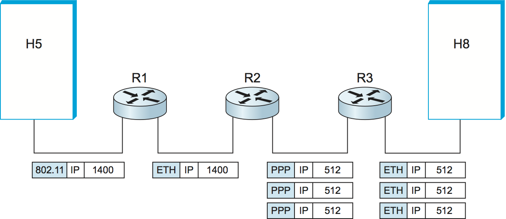
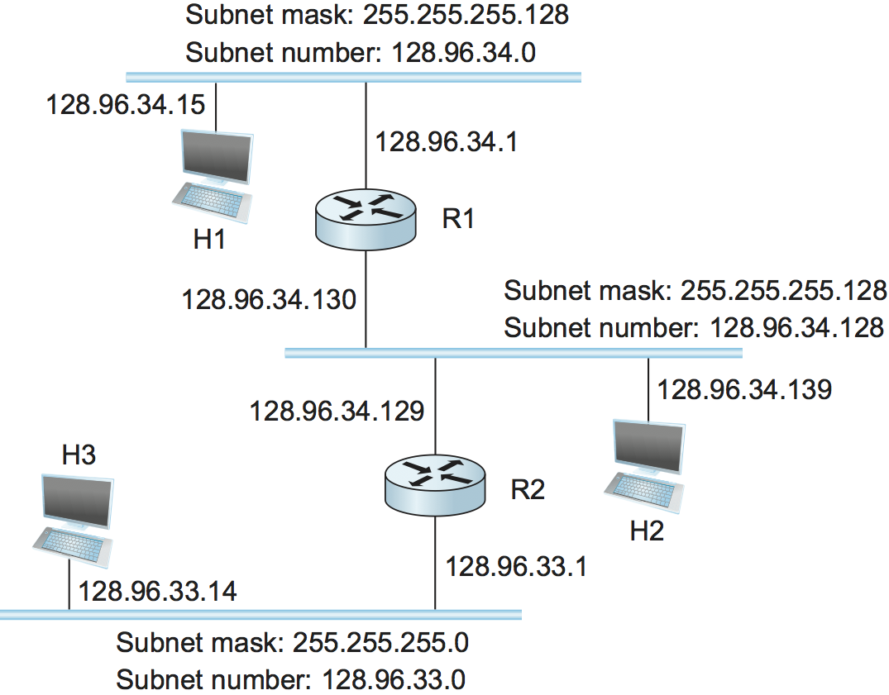
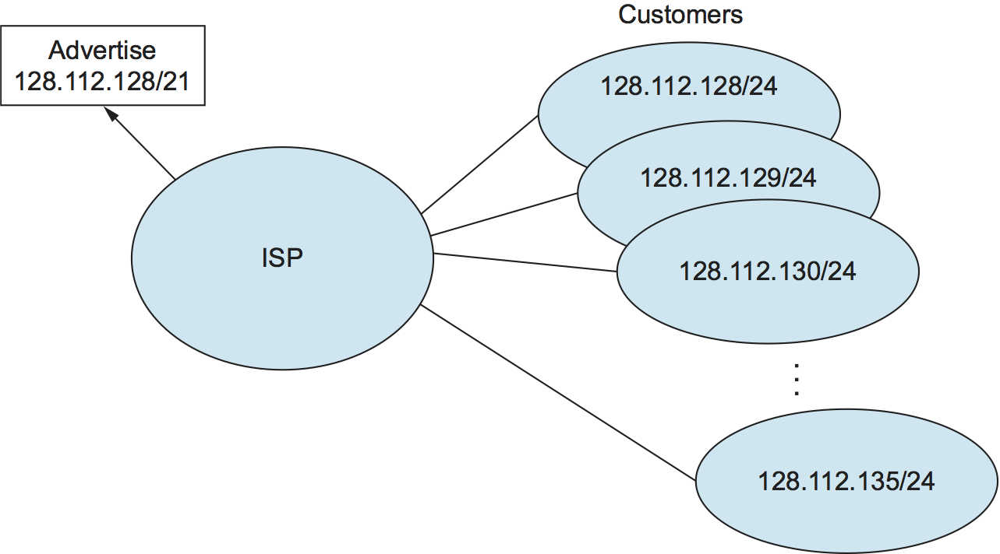
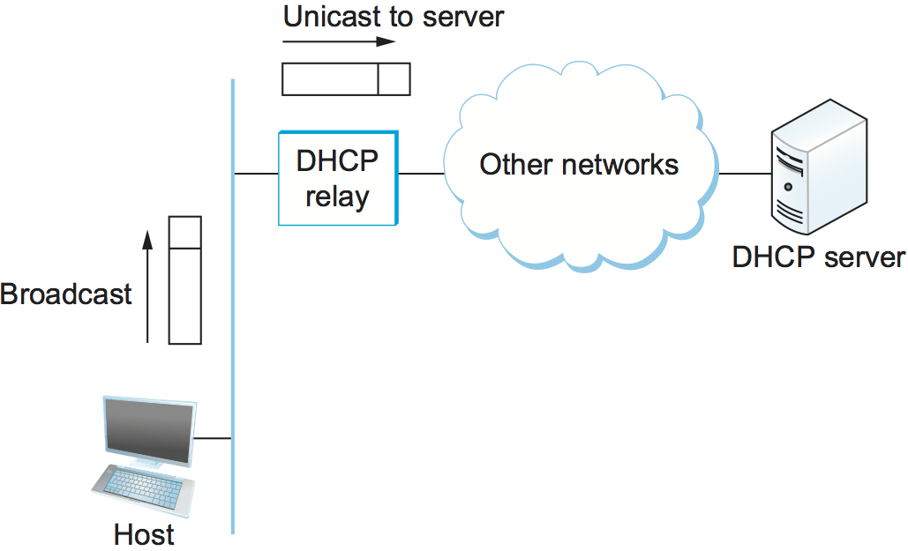
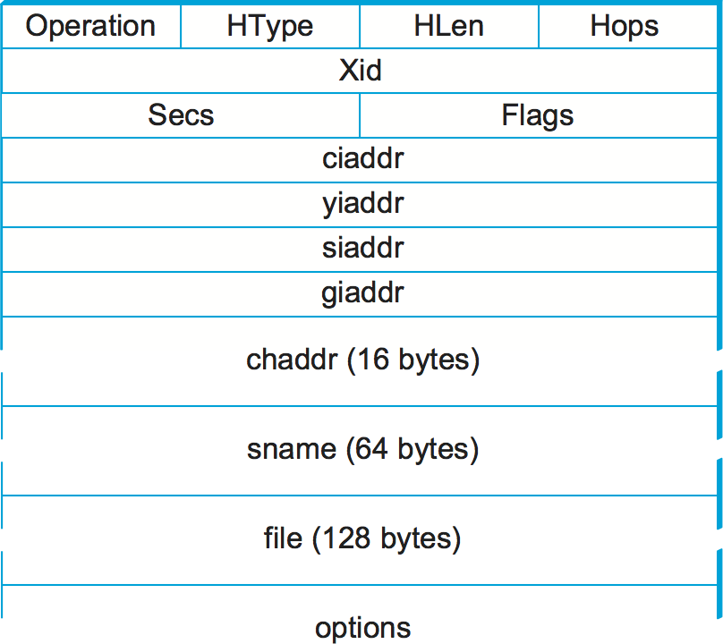

# {{Paj.Toe}}

在上一节中,我们看到使用桥和LAN交换机来构建相当大的LAN是可能的,但是这些方法在伸缩和处理异构性的能力方面是有限的. 在本节中,我们探索了一些超越桥接网络的限制的方法,使我们能够构建具有合理有效路由的大型ㄡ高度异构的网络. 我们指的是这样的网络. *互联网络. *在下一章中,我们将继续讨论如何构建一个真正的全球互联网,但是现在我们将探索基础知识. 我们从更仔细地考虑这个词开始. *互联网络*手段. 

## 什么是互联网络?

我们使用这个词*互联网络*,或者有时只是*互联网*小写字母*我*指的是任意互连的网络集合,以提供某种主机到主机的分组传递服务. 例如,具有许多站点的公司可以通过将位于其不同站点的LAN与从电话公司租用的点对点链接互连来构建私有互联网. 当我们谈论广泛使用的全球互联网络时,我们称之为*互联网*有资本*一. *根据本书的第一条原则,我们主要希望你了解"小写字母"的原理. *我*"联网",但我们从"大"的例子中说明了这些想法. *我*"互联网". 

另一个可以混淆的术语是网络ㄡ子网和互联网络之间的差异. 我们将避免子网络 (或子网) ,直到稍后的部分. 现在,我们使用*网络*在前一章和前一章中描述的是直接连接或交换网络. 这样的网络使用一种技术,例如802.11或以太网. 安*互联网络*是这样的网络的相互连接的集合. 有时,为了避免歧义,我们指的是我们正在互连的底层网络. *身体的*网络. 互联网是一个*符合逻辑的*由物理网络的集合构成的网络. 在这种情况下,由网桥或交换机连接的以太网络的集合将仍然被视为单个网络. 

<figure class="line">
	<a id="inet"></a>
	
	<figcaption>A simple internetwork. H denotes a host ane R denotes
	a router.</figcaption>
</figure>
	
[Figure 1](#inet) shows an example internetwork. An internetwork is
often referred to as a "network of networks" because it is made up of
lots of smaller networks. In this figure, we see Ethernets, a wireless
network, and a point-to-point link. Each of these is a single-technology
network. The nodes that interconnect the networks are called *routers*.
They are also sometimes called *gateways*, but since this term has
several other connotations, we restrict our usage to router.

<figure class="line">
	<a id="ip-graph"></a>
	
	<figcaption>A simple internetwork, showing the protocol layers
	used to connect H5 to H8 in the above figure. ETH is the protocol
	that runs over the Ethernet.</figcaption>
</figure>
	
The *Internet Protocol* is the key tool used today to build scalable,
heterogeneous internetworks. It was originally known as the Kahn-Cerf
protocol after its inventors. One way to think of IP is that it runs
on all the nodes (both hosts and routers) in a collection of networks
and defines the infrastructure that allows these nodes and networks to
function as a single logical internetwork. For example,
[Figure 2](#ip-graph) shows how hosts H5 and H8 are logically
connected by the internet in [Figure 1](#inet), including
the protocol graph running on each node. Note that higher-level
protocols, such as TCP and UDP, typically run on top of IP on the hosts.

本章的其余部分主要是关于知识产权的各个方面. 虽然当然有可能建立一个不使用IP的互联网,例如,Novell创建了一个称为IPX的互联网协议,而IPX又基于由Xerox-IP设计的XNS互联网,这是仅仅因为互联网的规模而需要研究的最有趣的案例. 换言之,只有IP互联网才真正面临规模问题. 因此,它提供了一个可扩展的互联网络协议的最佳案例研究. 

## 服务模型

建立一个互通网络的好地方是定义它的网络. *服务模型*,即,您要提供的主机到主机服务. 为互联网定义服务模型的主要关注点是,只有当该服务能够在每个底层物理网络上提供时,我们才能够提供主机到主机的服务. 例如,如果存在可以任意延迟分组的基础网络技术,那么确定我们的互联网服务模型将以1毫秒或更短的时间提供每个分组的保证传送是不好的. 因此,在定义IP服务模型时使用的哲学是使它足够不苛刻,以至于在互联网中出现的任何网络技术都能够提供必要的服务. 

IP服务模型可以认为包括两个部分: 一个寻址方案,它提供了识别互联网中所有主机的方法,以及一个数据报 (无连接) 的数据传递模型. 这种服务模式有时被称为*最大努力*因为,尽管IP尽一切努力传递数据报,但它不能保证. 现在我们推迟讨论寻址方案,先看一下数据传输模型. 

### 数据报传送

IP数据报是互联网协议的基础. 回想一个早期的部分,数据报是一种分组类型,它恰好以无连接的方式通过网络发送. 每个数据报都携带足够的信息,以便让网络将数据包转发到正确的目的地;不需要任何提前设置机制来告诉网络当数据包到达时做什么. 你只要发送它,网络尽最大努力把它送到所需的目的地. "尽力而为"部分意味着,如果一些事情出错了,而数据包丢失ㄡ损坏ㄡ传递不当或者以任何方式未能到达其预定目的地,则网络什么也不做ℴℴ它尽了最大的努力,这就是它必须做的. 它没有试图从失败中恢复. 这有时被称为*不可靠的*服务. 

尽最大努力,无连接的服务是关于你可以从互联网上要求的最简单的服务,这是一个很大的优势. 例如,如果您通过提供可靠服务的网络提供尽力而为的服务,那么很好,您最终得到的尽力而为的服务恰好总是传递数据包. 另一方面,如果在不可靠网络上有一个可靠的服务模型,则必须向路由器中添加许多额外的功能,以弥补底层网络的不足. 保持路由器尽可能简单是IP的最初设计目标之一. 

IP的"跑过任何东西"的能力经常被认为是它最重要的特征之一. 值得注意的是,在IP被发明的今天,许多IP技术运行的技术都不存在. 到目前为止,还没有发明过对IP来说太奇特的网络技术;甚至有人声称IP可以通过使用载体鸽子传输消息的网络运行. 

尽力交付不仅仅意味着数据包可能丢失. 有时,他们可以被交付无序,有时相同的包可以得到不止一次. 在IP之上运行的高级协议或应用程序需要知道所有这些可能的故障模式. 

### 数据包格式

显然,IP服务模型的一个关键部分是可以携带的数据包的类型. IP数据报,像大多数数据包一样,由一个报头组成,后面是许多字节的数据. 标头的格式显示在[图3](#iphead). 请注意,我们采用了不同于前面章节中使用的表示数据包的样式. 这是因为在互联网层和上面的分组格式 (我们将在下面几章中集中注意力) 几乎总是被设计成在32位边界上对齐,以简化在软件中处理它们的任务. 因此,表示它们 (例如,在Internet评论请求中使用) 的常用方法是将它们绘制为一系列32位的单词. 最上面的单词是第一个发送的单词,每个单词的最左边的字节是第一个发送的单词. 在这个表示中,您可以容易地识别长为8位的多个字段. 在字段不是8位的偶数倍的奇数情况下,可以通过查看标记在分组顶部的位位置来确定字段长度. 

<figure class="line">
	<a id="iphead"></a>
	
	<figcaption>IPv4 packet header.</figcaption>
</figure>

查看IP头中的每个字段,我们发现尽力而为的数据报传递的"简单"模型仍然具有一些微妙的特征. 这个`Version`字段指定IP的版本. IP的当前版本为4,有时称为*IPv4*. 请注意,在数据报的开头正确地设置这个字段使得在以后的版本中重新定义包格式中的所有其他内容变得容易;报头处理软件从查看版本开始,然后根据以下内容分支以处理包的其余部分适当的格式. 下一个字段,`HLen`在32位字中指定标题的长度. 当没有选项,这是大部分时间,标题是5字 (20字节) 长. 8位`TOS` (服务类型) 字段多年来有多个不同的定义,但是它的基本功能是允许根据应用需求以不同的方式对待分组. 例如,`TOS`值可能决定是否应该将包放置在接收低延迟的特殊队列中. 

头的下一个16位包含`Length`包括报头在内的数据报. 不像`HLen`字段`Length`字段计数字节而不是单词. 因此,IP数据报的最大大小是65535字节. 然而,IP所运行的物理网络可能不支持这样的长分组. 为此,IP支持碎片化和重组过程. 标题的第二个单词包含关于分段的信息,它的使用细节将在下面题为"分段和重新组装"的部分中介绍. 

移动到标题的第三个字,下一个字节是`TTL` (时间) 现场. 它的名字反映了它的历史意义,而不是今天常用的方式. 该字段的目的是捕获路由循环中运行的数据包并丢弃它们,而不是让它们无限期地消耗资源. 原来,`TTL`设置为允许分组存活的特定秒数,并且沿着路径的路由器将减少该字段直到它达到0. 然而,由于分组在路由器中很少停留长达1秒钟,并且路由器不能全部访问公共时钟,因此大多数路由器只是将`TTL`1时,他们转发了数据包. 因此,它变得比定时器更像是跳数,这仍然是捕获在路由循环中卡住的分组的完美好方法. 一个微妙之处在于发送主机对这个字段的初始设置: 设置得太高,在丢弃包之前包可能循环很多;设置得太低,它们可能无法到达目的地. 值64是当前默认值. 

这个`Protocol`字段只是一个解复用密钥,它标识应该传递该IP包的更高级协议. 对于TCP (传输控制协议-6) ㄡUDP (用户数据报协议-17) 和许多其他协议来说,在协议图中,都有定义在IP之上的值. 

这个`Checksum`通过将整个IP报头看作一个16位字的序列,使用一个补码算法将它们相加,并取结果的一个补码来计算. 这是后面一节中描述的IP校验和算法. 因此,如果报头中的任何位在运输中损坏,则校验和在接收到数据包时将不包含正确的值. 由于损坏的报头可能包含目的地址中的错误,并且结果可能传递不当,因此丢弃任何未能通过校验和的包是有意义的. 应该注意,这种校验和不具有与CRC相同的强错误检测特性,但是在软件中计算要容易得多. 

头中最后两个必填字段是"源代码". `and the`数据包的DestialAdDR'. 后者是数据报传递的关键: 每个数据包都包含其预定目的地的完整地址,以便可以在每个路由器上做出转发决策. 源地址是允许接收者决定是否接受包并允许它们应答的源地址. IP地址在稍后的部分中讨论,重要的是要知道IP定义它自己的全局地址空间,独立于它运行的任何物理网络. 正如我们将看到的,这是支持异质性的关键之一. 

最后,在页眉的末尾可能有许多选项. 选项的存在或不存在可通过检查头长度来确定 (`HLen`) 字段. 虽然选项很少使用,但完整的IP实现必须处理它们. 

### 碎片化与重组

通过异构网络集合提供统一的主机到主机服务模型的一个问题是,每种网络技术都趋向于对包的大小有自己的想法. 例如,以太网可以接受长达1500字节的分组,而FDDI(Fiber Distributed Data Interface,光纤分布式数据接口)的分组可以长达4500字节. 这给IP服务模型留下了两个选择: 确保所有IP数据报足够小,以适合任何网络技术上的一个分组,或者提供一种方法,当分组太大而不能遍历给定网络技术时,通过该方法可以对它们进行分段和重新组装. 后者被证明是一个不错的选择,特别是当你考虑到新的网络技术总是出现,并且IP需要运行在所有这些技术上时;这将使得很难在数据报大小上选择合适的小范围. 这也意味着主机不会发送不必要的小数据包,这浪费了带宽,并且由于每字节发送的数据需要更多的报头而消耗了处理资源. 例如,连接到通过点对点链路互连的FDDI网络的两个主机不需要发送足够小以适合以太网的分组. 

这里的核心思想是每个网络类型都有一个*最大传输单元* (MTU) ,它是最大的IP数据报,它可以在一个帧中携带. 请注意,该值小于该网络上的最大数据包大小,因为IP数据报需要安装在*有效载荷*链路层帧. 

> 在ATM网络中,MTU很幸运地比单个小区大得多,因为ATM有它自己的碎裂机制. ATM中的链路层帧称为*会聚子层协议数据单元* (CS-PDU) . 

因此,当主机发送IP数据报时,它可以选择它想要的任何大小. 一个合理的选择是主机直接连接的网络MTU. 然后,如果到达目的地的路径包括具有较小MTU的网络,则仅需要碎片. 然而,如果位于IP之上的传输协议给IP一个比本地MTU大的分组,则源主机必须对其进行分段. 

当路由器接收到它希望通过具有比接收到的数据报小的MTU的网络转发的数据报时,通常会发生分段. 为了使这些片段能够在接收主机上重新组装,它们都携带相同的标识符. `Ident`字段. 此标识符由发送主机选择,并且意在在可能经过一段合理时间段从此源到达目的地的所有数据报中是唯一的. 因为原始数据报的所有片段都包含这个标识符,所以重新组装的主机将能够识别那些结合在一起的片段. 如果所有片段没有到达接收主机,则主机放弃重新组装过程并丢弃确实到达的片段. IP不试图从丢失的片段中恢复. 

<figure class="line">
	<a id="frag"></a>
	
	<figcaption>IP datagrams traversing the sequence of physical
	networks graphed in the earlier figure.</figcaption>
</figure>
	
To see what this all means, consider what happens when host H5 sends a
datagram to host H8 in the example internet shown in [Figure 1](#inet).
Assuming that the MTU is 1500 bytes for the two
Ethernets and the 802.11 network, and 532 bytes for the point-to-point
network, then a 1420-byte datagram (20-byte IP header plus 1400 bytes
of data) sent from H5 makes it across the 802.11 network and the first
Ethernet without fragmentation but must be fragmented into three
datagrams at router R2. These three fragments are then forwarded by
router R3 across the second Ethernet to the destination host. This
situation is illustrated in [Figure 4](#frag). This figure
also serves to reinforce two important points:

1.  每个片段本身是一个独立的IP数据报,通过物理网络序列传输,独立于其他片段. 

2.  每个IP数据报被重新封装在其所传送的每个物理网络上. 

<figure class="line">
	<a id="fragment"></a>
	
	<figcaption>Header fields used in IP fragmentation:
	(a) unfragmented packet; (b) fragmented packets.</figcaption>
</figure>

通过查看每个数据报的报头字段,可以详细地理解碎片化过程,如[图5](#fragment). 顶部显示的未分割数据包具有1400字节的数据和20字节的IP报头. 当分组到达路由器R2时,路由器具有532兆字节的MTU,它必须被碎片化. 一个532字节的MTU在20字节IP报头之后留下512字节的数据,因此第一个片段包含512个字节的数据. 路由器将M位设置为`Flags`字段 (见) [图3](#iphead),这意味着有更多的片段要跟随,并且它设置了`Offset`到0,因为这个片段包含原始数据报的第一部分. 在第二个片段中携带的数据从原始数据的第五百一十三个字节开始,所以`Offset`这个头中的字段设置为64,这是512/8. 为什么除以8?因为IP的设计者决定,碎片应该总是发生在8字节边界上,这意味着`Offset`字段计数8字节块,而不是字节.  (我们将它留给您作为练习,以找出为什么做出这个设计决定. ) 第三个片段包含最后376字节的数据,并且偏移量现在是2$乘以$512/8=128. 由于这是最后一个片段,所以M位不被设置. 

请注意,碎片化过程是以这样的方式进行的,即,如果一个碎片到达另一个具有更小MTU的网络,则可以重复该过程. 分段产生更小ㄡ有效的IP数据报,这些数据报在接收时可以很容易地重新组合成原始数据报,而不依赖于它们到达的顺序. 在接收主机上进行重新组装,而不是在每个路由器上进行重新组装. 

IP重组远不是一个简单的过程. 例如,如果丢失了单个片段,则接收方仍将尝试重新组装数据报,并且最终将放弃并且必须对用于执行失败的重新组装的资源进行垃圾收集. 获取主机不必要地捆绑资源可能是拒绝服务攻击的基础. 

出于这个原因,IP碎片通常被认为是一个很好的事情来避免. 现在强烈鼓励主机执行"路径MTU发现",通过发送小到足以穿过与从发送者到接收者路径中的最小MTU的链路的分组,可以避免分段. 

## 全局地址

在上述IP服务模型的讨论中,我们提到了它提供的一个问题是寻址方案. 毕竟,如果您希望能够将数据发送到任何网络上的任何主机,则需要有一种识别所有主机的方法. 因此,我们需要一个全局寻址方案,其中没有两个主机具有相同的地址. 全局唯一性是在寻址方案中应该提供的第一个属性. 

以太网地址是全球唯一的,但仅此一点就不足以满足大型互联网络中的寻址方案. 以太网地址也是*平的*这意味着它们没有结构,并且很少提供路由协议的线索.  (事实上,以太网地址确实有一个结构. *分配*-前24位标识制造商,但是这没有为路由协议提供有用的信息,因为这种结构与网络拓扑无关. ) *分级的*我们的意思是,它们是由与网络中某种层次结构相对应的几个部分组成的. 具体来说,IP地址由两部分组成,通常称为*网络*部分与A*主办*部分. 这是一个相当合理的网络结构,它是由许多互连网络组成的. IP地址的网络部分标识主机所连接的网络;所有连接到同一网络的主机在其IP地址中具有相同的网络部分. 然后,主机部分在该特定网络上唯一地标识每个主机. 因此,在简单的互联网络中[图1](#inet)例如,网络1上的主机的地址将具有相同的网络部分和不同的主机部件. 

注意,路由器在[图1](#inet)连接到两个网络. 他们需要在每个网络上有一个地址,每个接口都有一个地址. 例如,位于无线网络与以太网之间的路由器R1在与无线网络的接口上具有IP地址,该无线网络的网络部分与该网络上的所有主机相同. 它在以太网的接口上也有一个IP地址,该以太网具有与以太网上的主机相同的网络部分. 因此,考虑到路由器可能被实现为具有两个网络接口的主机,将IP地址看作属于接口比看作属于主机更精确. 

现在,这些分层地址看起来像什么?与其他形式的分层地址不同,这两个部分的大小对于所有地址都不相同. 最初,IP地址被分成三个不同的类,如[图6](#class)每一个都定义了不同大小的网络和主机部分.  (还有指定多播组的D类地址和当前未使用的E类地址. ) 在所有情况下,地址都是32位长. 

IP地址的类在最重要的几个比特中被识别. 如果第一个比特是0,则是一个类A地址. 如果第一位是1,第二位是第0位,则是类B地址. 如果前两位是1,第三是0,则是类C地址. 因此,在大约40亿个可能的IP地址中,一半是A类,四分之一是B类,八分之一是C类. 每个类为地址的网络部分分配一定数量的比特,其余为主机部分分配一定数量的比特. A类网络对于网络部分有7比特,对于主机部分有24比特,这意味着只能有126个A类网络 (值0和127被保留) ,但是它们中的每一个都可以容纳多达2美元^{24}$$-2 (大约1600万) 的主机 (同样,还有两个保留值) . B类地址为网络分配14位,为主机分配16位,这意味着每个B类网络都有65534台主机的空间. 最后,类C地址对于主机只有8个位,网络部分只有21个位. 因此,类C网络只能具有256个唯一的主机标识符,这意味着只有254个附加主机(一个主机标识符255被保留用于广播,0不是有效的主机号). 然而,寻址方案支持2 $ $^ { 21 } $$类C网络. 

<figure class="line">
	<a id="class"></a>
	
	<figcaption>IP addresses: (a) class A; (b) class B; (c) class C.</figcaption>
</figure>
 	
On the face of it, this addressing scheme has a lot of flexibility,
allowing networks of vastly different sizes to be accommodated fairly
efficiently. The original idea was that the Internet would consist of a
small number of wide area networks (these would be class A networks), a
modest number of site- (campus-) sized networks (these would be class B
networks), and a large number of LANs (these would be class C networks).
However, it turned out not to be flexible enough, as we will see in a
moment. Today, IP addresses are normally "classless"; the details of
this are explained below.

在我们研究IP地址如何使用之前,看看一些实际问题,比如如何写下来是有帮助的. 按照惯例,IP地址写为四. *十进制的*用点分隔的整数. 每个整数表示地址的1字节中包含的十进制值,从最重要的开始. 例如,键入该句子的计算机的地址是`171.69.210.245`.

重要的是不要混淆IP地址和因特网域名,这些域名也是分级的. 域名往往是由点分隔的ASCII字符串,如`cs.princeton.edu`. 关于IP地址的重要一点是它们是IP分组的头部所携带的,并且是那些在IP路由器中用于作出转发决策的地址. 

## IP中的数据报转发

现在我们要研究IP路由器在互联网络中转发数据报的基本机制. 回忆一下前面的章节*转发*是从一个输入中取出一个包并将其输出到适当的输出的过程,而*路由*是建立表以允许数据包的正确输出被确定的过程. 这里的讨论侧重于转发,我们在稍后的部分中进行路由. 

当我们讨论IP数据报的转发时,要牢记的要点如下: 

-   每个IP数据报都包含目标主机的IP地址. 

-   IP地址的网络部分唯一地标识作为较大因特网的一部分的单个物理网络. 

-   共享其地址的相同网络部分的所有主机和路由器都连接到相同的物理网络,因此可以通过通过该网络发送帧来彼此通信. 

-   作为因特网一部分的每个物理网络都具有至少一个路由器,根据定义,该路由器也连接到至少一个其他物理网络;该路由器可以与任一网络上的主机或路由器交换分组. 

因此,可以通过以下方式来处理转发IP数据报. 数据报从源主机发送到目的主机,可能沿路通过多个路由器. 任何节点,无论是主机还是路由器,首先尝试确定它是否连接到与目的地相同的物理网络. 为此,它将目的地址的网络部分与其每个网络接口的地址的网络部分进行比较.  (主机通常只有一个接口,而路由器通常有两个或更多个接口,因为它们通常连接到两个或更多个网络. ) 如果发生匹配,则意味着目的地位于与接口相同的物理网络上,并且分组可以直接通过该接口传递. 在网络上. 后面的部分解释了这个过程的一些细节. 

如果节点没有连接到与目的地节点相同的物理网络,则需要将数据报发送到路由器. 通常,每个节点可以选择几个路由器,因此它需要选择最好的路由器,或者至少选择一个能够使数据报更接近其目的地的路由器. 它所选择的路由器称为*下一跳*路由器. 路由器通过查询转发表找到正确的下一跳. 转发表在概念上仅仅是$$Langle $$的列表. `NetworkNum,` `NextHop`$$$angle $$对.  (正如我们将在下面看到的,在实践中转发表通常包含一些与下一跳相关的附加信息. ) 通常,如果表中的条目与目的地的网络号码不匹配,则还会使用默认路由器. 对于主机,使用默认路由器是完全可以接受的,而不使用其他路由器ℴℴ这意味着所有发往不在发送主机所连接的物理网络上的主机的数据报都将通过默认路由器发送. 

我们可以通过以下方式描述数据报转发算法: 

```pseudo
if (NetworkNum of destination = NetworkNum of one of my interfaces) then
    deliver packet to destination over that interface
else
    if (NetworkNum of destination is in my forwarding table) then
        deliver packet to NextHop router
    else
        deliver packet to default router
```

对于只有一个接口的主机和它的转发表中只有一个默认路由器,这简化了

```pseudo
if (NetworkNum of destination = my NetworkNum) then
    deliver packet to destination directly
else
    deliver packet to default router
```

让我们看看在示例的互联网络中是如何工作的. [图1](#inet). 首先,假设H1想要发送一个数据报给H2. 由于它们在同一物理网络上,所以H1和H2在它们的IP地址中具有相同的网络编号. 因此,H1推断它可以通过以太网将数据报直接传送到H2. 需要解决的一个问题是H1如何找到H2的正确以太网地址ℴℴ这是稍后部分中描述的地址解析机制. 

现在假设H5想发送一个数据报到H8. 由于这些主机位于不同的物理网络上,因此它们具有不同的网络号,因此H5推断它需要将数据报发送到路由器. R1是默认路由器的唯一选择,因此H1通过无线网络将数据报发送到R1. 类似地,R1知道它不能直接向H8传送数据报,因为R1的接口都不与H8在同一网络上. 假设R1的默认路由器是R2;R1然后通过以太网将数据报发送到R2. 假设R2具有转发表所示[表1](#ipfwdtab)它查找H8的网络号码 (网络4) ,并将数据报转发到点对点网络到R3. 最后,R3,因为它在与H8相同的网络上,将数据报直接转发到H8. 

<a id="ipfwdtab"></a>

|  网箱 | 奈克斯托普 |
| :-: | :---: |
|  一  |   R1  |
|  四  |   R3  |

*表1. 路由器R2的转发表. *

<a id="tab5.3"></a>

|  网箱 | 奈克斯托普 |
| :-: | :---: |
|  一  |   R1  |
|  二  |  接口1  |
|  三  |  接口0  |
|  四  |   R3  |

*表2. 路由器R2的完整转发表. *

注意,可以在转发表中包含关于直接连接的网络的信息. 例如,我们可以将路由器R2的网络接口标记为点对点链路(网络3)的接口0和以太网(网络2)的接口1. 然后R2将具有转发表中显示的[表2](#tab5.3).

因此,对于R2在分组中遇到的任何网络号码,它知道要做什么. 要么该网络直接连接到R2,在这种情况下,分组可以通过该网络传送到其目的地,要么该网络可以通过R2可以通过其连接的网络到达的下一跳路由器. 在这两种情况下,R2将使用下面描述的ARP来查找将要发送该分组的节点的MAC地址. 

R2所使用的转发表足够简单,可以手动配置. 但是,通常,这些表比较复杂,可以通过运行路由协议来构建,如后面部分中描述的路由协议. 还要注意的是,在实践中,网络号码通常较长 (例如,128.96) . 

现在我们可以看到分层寻址 (将地址分成网络和主机部分) 如何改进了大型网络的可伸缩性. 路由器现在包含只列出一组网络号码而不是网络中所有节点的转发表. 在我们的简单示例中,这意味着R2可以将到达网络中所有主机 (其中有8个主机) 所需的信息存储在一个四条目表中. 即使在每个物理网络上有100个主机,R2仍然只需要那些相同的四个条目. 这是实现可伸缩性的第一步 (虽然不是最后一步) . 

这说明了构建可伸缩网络的最重要的原则之一: 为了实现可伸缩性,需要减少存储在每个节点中并在节点之间交换的信息量. 最常用的方法是*层次聚集*. IP引入了两级层次结构,网络处于顶层,节点位于底层. 通过让路由器只处理到达正确网络的问题,我们已经聚合了信息;路由器需要向给定网络上的任何节点传递数据报的信息由单个聚合的信息片段表示. 

## 子网和无类别寻址

IP地址的最初意图是网络部分将唯一地标识一个物理网络. 事实证明,这种方法有两个缺点. 想象一下,一个拥有很多内部网络并决定连接互联网的大型校园. 对于每一个网络,无论多么小,站点至少需要一个类C的网络地址. 更糟糕的是,对于超过255个主机的网络,它们需要一个类的B地址. 这似乎没什么大不了的,而且确实不是第一次设想因特网的时候,但是只有有限数量的网络号码,而且B类地址比C类地址少得多. B类地址的需求特别高,因为您永远不知道您的网络是否可能扩展到超过255个节点,所以从一开始使用B类地址要比在C类网络上用完空间时必须重新编号每个主机更容易. 我们在此观察到的问题是地址分配效率低下: 具有两个节点的网络使用整个C类网络地址,从而浪费了253个完全有用的地址;具有略多于255的B类网络浪费了64000多个地址. 

因此,为每个物理网络分配一个网络号码可能比我们想象的要快得多. 虽然我们需要连接超过40亿个主机来耗尽所有有效地址,但是在部分地址空间耗尽之前,我们只需要连接2$^{14}$$$ (大约16000) 类B网络. 因此,我们希望找到一些更有效地使用网络号码的方法. 

分配许多网络号码有另一个缺点,当你想到路由时会变得明显. 回想一下,在参与路由协议的节点中存储的状态量与其他节点的数量成比例,并且因特网中的路由包括建立转发表,该表告诉路由器如何到达不同的网络. 因此,使用的网络号码越多,转发表就越大. 大型转发表给路由器增加了成本,而且对于给定的技术,它们可能比小型表搜索速度慢,因此降低了路由器的性能. 这为仔细指派网络号码提供了另一个动机. 

*子网划分*提供减少分配的网络号码总数的第一步. 其思想是采用单个IP网络编号,并将具有该网络编号的IP地址分配给几个物理网络,这些物理网络现在称为*子网*. 做这件事需要做几件事. 首先,子网应该彼此接近. 这是因为,在互联网的远处,它们看起来就像一个单独的网络,它们之间只有一个网络号. 这意味着路由器将只能选择一条路线到达任何子网,因此它们最好都在相同的总方向上. 使用子网的一个完美的情况是一个大的校园或公司,它有许多物理网络. 从校园外部,你需要知道的是到达校园内的任何子网是校园连接到互联网的其余部分. 这通常是在一个单一的点,所以一个条目在您的转发表就足够了. 即使校园与互联网的其他部分有多个连接点,知道如何到达校园网络中的一个点仍然是一个好的开始. 

在多个网络之间共享单个网络号码的机制包括使用以下命令配置每个子网上的所有节点*子网掩码*. 使用简单的IP地址,同一网络上的所有主机必须具有相同的网络号码. 子网掩码使我们能够引入*子网号*同一物理网络上的所有主机将具有相同的子网号,这意味着主机可能位于不同的物理网络上,但共享单个网络号. 这个概念在[图7](#subaddr).

<figure class="line">
	<a id="subaddr"></a>
	
	<figcaption>Subnet addressing.</figcaption>
</figure>
 	
What subnetting means to a host is that it is now configured with both
an IP address and a subnet mask for the subnet to which it is attached.
For example, host H1 in [Figure 8](#subnet) is configured with an
address of 128.96.34.15 and a subnet mask of 255.255.255.128. (All hosts
on a given subnet are configured with the same mask; that is, there is
exactly one subnet mask per subnet.) The bitwise AND of these two
numbers defines the subnet number of the host and of all other hosts on
the same subnet. In this case, 128.96.34.15 AND 255.255.255.128 equals
128.96.34.0, so this is the subnet number for the topmost subnet in the
figure.

<figure class="line">
	<a id="subnet"></a>
	
	<figcaption>An example of subnetting.</figcaption>
</figure>
 	
When the host wants to send a packet to a certain IP address, the first
thing it does is to perform a bitwise AND between its own subnet mask
and the destination IP address. If the result equals the subnet number
of the sending host, then it knows that the destination host is on the
same subnet and the packet can be delivered directly over the subnet. If
the results are not equal, the packet needs to be sent to a router to be
forwarded to another subnet. For example, if H1 is sending to H2, then
H1 ANDs its subnet mask (255.255.255.128) with the address for H2
(128.96.34.139) to obtain 128.96.34.128. This does not match the subnet
number for H1 (128.96.34.0) so H1 knows that H2 is on a different
subnet. Since H1 cannot deliver the packet to H2 directly over the
subnet, it sends the packet to its default router R1.

当我们引入子网时,路由器的转发表也发生了轻微的变化. 回想一下,我们以前有一个包含表格条目的转发表. `(NetworkNum, NextHop)`. 为了支持子网,表现在必须保存窗体的条目. `(SubnetNumber, SubnetMask, NextHop)`. 要查找表中的正确条目,路由器将包的目标地址与`SubnetMask`对于每个条目依次;如果结果匹配`SubnetNumber`在该条目中,这是使用的正确条目,并将该分组转发到所指示的下一跳路由器. 在示例网络中[图8](#subnet)路由器,R1将有条目显示在[表2](#subnettab).

<a id="subnettab"></a>

| 子网号          | 子网路遮罩           | 奈克斯托普 |
| :----------- | :-------------- | :---- |
| 12893.34.0   | 255.255.255.128 | 接口0   |
| 12893.34.128 | 255.255.255.128 | 接口1   |
| 12893.33.0   | 255.255.255.0   | R2    |

*表3. 具有子网的示例转发表. *

继续从H1发送到H2的数据报的例子,R1将使用第一条目的子网掩码(255.255.255.128)AND H2的地址(128.96.34.139),并将结果(128.96.34.128)与该条目的网络号(128.96.34.0)进行比较. 因为这不是一个匹配,它进入下一个条目. 这次确实发生匹配,因此R1使用接口1将数据报传送到H2,接口1是连接到与H2相同的网络的接口. 

现在我们可以用以下方式描述数据报转发算法: 

```pseudo
D = destination IP address
for each forwarding table entry (SubnetNumber, SubnetMask, NextHop)
    D1 = SubnetMask & D
    if D1 = SubnetNumber
        if NextHop is an interface
            deliver datagram directly to destination
        else
            deliver datagram to NextHop (a router)
```

虽然本例中没有显示,但是默认路由通常包含在表中,如果没有找到显式匹配,则将使用默认路由. 我们顺便指出,这种算法的幼稚实现是非常低效的,这种算法涉及使用子网掩码对目的地址进行重复ANDing,子网掩码可能不会每次都不同,线性表搜索也是如此. 

子网的一个重要后果是互联网的不同部分对世界的看法不同. 从我们假设的校园之外,路由器看到一个单一的网络. 在上面的示例中,校园外的路由器看到了网络中的集合. [图8](#subnet)作为网络128.96,他们在转发表中保持一个条目,告诉他们如何到达它. 然而,校园内的路由器需要能够将分组路由到正确的子网. 因此,不是因特网的所有部分都看到完全相同的路由信息. 这是一个例子. *聚集*路由信息,这是路由系统缩放的基础. 下一节说明如何将聚合应用到另一个级别. 

### 无类别寻址

子网具有对应关系,有时称为*超网*但更经常被称为*无类别域间路由*或者CIDR,发音为"cider". 为什么子网单独不够?本质上,子网只允许我们在多个子网中分割一个分类地址,而CIDR允许我们将几个分类地址合并成一个"超级网". 过载. 

要了解路由系统的地址空间效率和可伸缩性问题是如何耦合的,请考虑一个假设的例子,即网络上有256个主机的公司. 这对于C类地址来说有点太多,所以您可能想分配一个B类. 但是,使用地址65535到地址256主机的地址空间块效率只有256/65535=0.39%. 即使子网能够帮助我们仔细地分配地址,它也不能回避这样一个事实,即任何拥有超过255台主机的组织,或者期望最终拥有那么多主机的组织都想要一个B类地址. 

第一种方式你可以处理这个问题会拒绝给一个B类地址的任何组织要求,除非他们能证明一种接近64K 地址的需要,而不是给他们一个合适的 C类地址数量覆盖主机的预期数量既然我们现在已经送出256 地址块的地址空间时,我们可以更准确地匹配的地址空间消耗规模的组织量. 对于任何具有至少256个主机的组织,我们可以保证至少50%的地址利用率,并且通常更大. 

然而,这种解决方案至少引发了一个问题: 路由器上的存储需求过大. 如果一个网站,说,16类 C网号码分配给它,这意味着每一个互联网骨干路由器的路由表中的条目需要16直接包给网站. 即使每个网络的路径相同,这也是正确的. 如果我们给站点分配了一个类B地址,那么相同的路由信息可以存储在一个表项中. 然而,我们的地址分配效率将只有6美元$ \\ $ 255/65536美元=6.2%. 

CIDR,因此,试图平衡的愿望减少,路由器需要知道和需要把地址有效路径数. 为了做到这一点,CIDR帮助我们*骨料*路线. 也就是说,它让我们在转发表中使用单个条目来告诉我们如何访问许多不同的网络. 如上所述,它通过打破地址类之间的刚性边界来实现这一点. 要理解这是如何工作的,考虑我们的假设组织有16类C C网络号码. 而不是随机分发16个地址,我们可以分发一个*邻接的*类C地址. 假设我们把类C网络号从192.4.16分配到192.4.31. 观察到在这个范围内所有地址的前20位都是相同的. `11000000 00000100 0001`) 因此,我们已经有效地创建的是一个20位网络号是一类 B网络号和一类 C中的主机数量术语之间,它可以支持. 换句话说,我们得到的高地址效率分发块小于 B类网络地址,和一个单一的网络前缀,可用于转发表. 观察到,这一方案的工作,我们需要把 C类地址都有一个共同的前缀块,这意味着每一块必须包含一个数字 C类网络,是一个两个电源. 

CIDR需要一种新的表示网络号码的符号,或者*前缀*因为它们是已知的,因为前缀可以是任意长度的. 公约是放置一个`/X`前缀之后,何处`X`前缀长度为位. 因此,对于上面的例子,所有网络192.4.16到192.4.31的20位前缀表示为192.4.16/20. 相比之下,如果我们想代表一个C类的网络编号,它是24位长的,我们将写192.4.16/24. 如今,以CIDR为标准,人们更常听到人们谈论"斜杠24"前缀而不是C类网络. 注意,以这种方式表示网络地址类似于`(mask, value)`在子网中使用的方法,只要`masks`包括从最高位开始的连续位 (实际上几乎总是如此) . 

<figure class="line">
	<a id="cidreg"></a>
	
	<figcaption>Route aggregation with CIDR.</figcaption>
</figure>
 	
The ability to aggregate routes at the edge of the network as we have
just seen is only the first step. Imagine an Internet service provider
network, whose primary job is to provide Internet connectivity to a
large number of corporations and campuses (customers). If we assign
prefixes to the customers in such a way that many different customer
networks connected to the provider network share a common, shorter
address prefix, then we can get even greater aggregation of routes.
Consider the example in [Figure 9](#cidreg). Assume that eight
customers served by the provider network have each been assigned
adjacent 24-bit network prefixes. Those prefixes all start with the same
21 bits. Since all of the customers are reachable through the same
provider network, it can advertise a single route to all of them by just
advertising the common 21-bit prefix they share. And it can do this even
if not all the 24-bit prefixes have been handed out, as long as the
provider ultimately *will* have the right to hand out those prefixes to
a customer. One way to accomplish that is to assign a portion of address
space to the provider in advance and then to let the network provider
assign addresses from that space to its customers as needed. Note that,
in contrast to this simple example, there is no need for all customer
prefixes to be the same length.

### IP转发

在我们迄今为止关于IP转发的所有讨论中,我们假设可以在分组中找到网络号码,然后在转发表中查找该号码. 然而,既然我们已经引入了CIDR,我们需要重新审视这个假设. CIDR意味着前缀可以是任何长度,从2到32位. 此外,有时有可能在转发表中具有"重叠"的前缀,即某些地址可以匹配多个前缀. 例如,我们可以在单个路由器的转发表中找到171.69 (16位前缀) 和171.69.10 (24位前缀) . 在这种情况下,指定为171.67.105的分组显然匹配两个前缀. 本例中的规则基于"最长匹配"原则,即,分组匹配最长前缀,在本例中为171.69.10. 另一方面,命中到171.6920.5的分组将匹配171.69和*不*171.6910,并且在路由表171.69中没有任何其他匹配项时,将是最长匹配. 

在转发表中高效地找到IP地址和可变长度前缀之间的最长匹配是近年来一个富有成果的研究领域,本章的进一步阅读部分提供了一些参考. 最著名的算法使用一种称为*帕特丽夏树*它实际上是在CIDR之前发展得很好的. 

## 地址转换 (ARP) 

在上一节中,我们讨论了如何将IP数据报发送到正确的物理网络,但详细讨论了如何将数据报发送到网络上的特定主机或路由器的问题. 主要问题是IP数据报包含IP地址,但是要向其发送数据报的主机或路由器上的物理接口硬件仅理解该特定网络的寻址方案. 因此,我们需要将IP地址转换为在该网络上有意义的链路级地址 (例如,48位以太网地址) . 然后,我们可以将IP数据报封装在包含该链路级地址的帧中,并将其发送到最终目的地或承诺将数据报转发到最终目的地的路由器. 

将IP地址映射到物理网络地址的一种简单方法是在主机的IP地址的主机部分中编码主机的物理地址. 例如,具有物理地址的主机`00100001 01001001` (在上字节中有十进制值33,在下字节中有81) 可以给出IP地址. `128.96.33.81`. 虽然这种解决方案已经在一些网络上使用,但其局限性在于,在这个示例中,网络的物理地址不能超过16比特长;在C类网络上,它们只能是8比特长. 这显然不能用于48位以太网地址. 

更一般的解决方案是让每个主机维护一个地址对表;也就是说,该表将IP地址映射到物理地址. 虽然这个表可以由系统管理员集中管理,然后复制到网络上的每个主机,但是更好的方法是让每个主机使用网络动态地学习表的内容. 这可以使用地址解析协议 (ARP) 来完成. ARP的目标是使网络上的每个主机能够建立IP地址和链路级地址之间的映射表. 由于这些映射可能随着时间而改变 (例如,因为主机中的以太网卡中断,并由具有新地址的新卡替换) ,所以条目被周期性地超时并被删除. 这种情况发生在每15分钟一次. 当前存储在主机中的映射集合称为ARP缓存或ARP表. 

ARP利用这样的事实,许多链路级网络技术,如以太网,支持广播. 如果主机希望向其知道位于同一网络上的主机 (或路由器) 发送IP数据报 (即,发送和接收节点具有相同的IP网络号) ,则首先检查缓存中的映射. 如果没有找到映射,则需要调用网络上的地址解析协议. 它通过在网络上广播ARP查询来实现这一点. 此查询包含IP地址 (目标IP地址) . 每个主机接收查询并检查它是否匹配它的IP地址. 如果匹配,主机将包含其链路层地址的响应消息发送回查询的发起方. 发起人将包含在该响应中的信息添加到ARP表中. 

查询消息还包括发送主机的IP地址和链路层地址. 因此,当主机广播查询消息时,网络上的每个主机可以了解发送者的链接级别和IP地址,并将该信息放入其ARP表中. 但是,并不是每个主机都将此信息添加到ARP表中. 如果主机的表中已经有该主机的条目,则它"刷新"该条目;也就是说,它重置时间长度,直到它丢弃该条目. 如果该主机是查询的目标,则它将关于发送方的信息添加到它的表中,即使它尚未具有该主机的条目. 这是因为源主机很有可能要向其发送应用程序级别的消息,并且它最终可能必须向源发送响应或ACK;为此,它需要源的物理地址. 如果主机不是目标,并且在其ARP表中没有源条目,那么它不为源添加条目. 这是因为没有理由相信这个主机永远需要源链接级别的地址;没有必要用这些信息弄乱它的ARP表. 

<figure class="line">
	<a id="arp"></a>
	
	<figcaption>ARP packet format for mapping IP addresses into
	Ethernet addresses.</figcaption>
</figure>
 	
[Figure 10](#arp) shows the ARP packet format for
IP-to-Ethernet address mappings. In fact, ARP can be used for lots of
other kinds of mappings—the major differences are in the address
sizes. In addition to the IP and link-layer addresses of both sender
and target, the packet contains

-   一`HardwareType`字段,它指定物理网络 (例如以太网) 的类型. 

-   一`ProtocolType`字段,它指定更高层协议 (例如,IP) . 

-   `HLen` ("硬件"地址长度) 和`PLen` ("protocol"地址长度) 字段,它们分别指定链路层地址和高层协议地址的长度

-   安`Operation`字段,它指定这是请求还是响应. 

-   源和目标硬件 (以太网) 和协议 (IP) 地址

注意,ARP过程的结果可以作为表4.1中的一个额外的列添加到转发表中. 因此,例如,当R2需要将一个分组转发到网络2时,它不仅发现下一跳是R1,而且发现要在分组上放置MAC地址以将其发送到R1. 

现在我们已经看到了IP为处理异质性和规模提供的基本机制. 关于异构性问题,IP首先定义一个尽力而为的服务模型,该模型对底层网络作出最小的假设;最显著的是,该服务模型基于不可靠的数据报. 然后,IP对这个起点做了两个重要的补充: (1)公共分组格式(分段/重组是使这种格式在不同MTU网络上工作的机制)和(2)用于标识所有主机的全局地址空间(ARP是使这种格式成为全局的机制). 地址空间在具有不同物理寻址方案的网络上工作. 在规模问题上,IP采用分层聚合来减少转发分组所需的信息量. 具体而言,IP地址被划分成网络和主机组件,数据包首先被路由到目的地网络,然后被传送到该网络上的正确主机. 

## 主机配置 (DHCP) 

以太网地址由制造商配置到网络适配器中,并且以这种方式管理这个过程,以确保这些地址是全局唯一的. 这显然是确保连接到单个以太网 (包括扩展LAN) 的任何主机集合将具有唯一地址的充分条件. 此外,以太网地址的唯一性就是我们所要求的. 

相比之下,IP地址不仅在给定的互联网上必须是唯一的,而且必须反映互联网的结构. 如上所述,它们包含网络部分和主机部分,并且网络部分对于同一网络上的所有主机必须相同. 因此,在制造IP地址时,不可能将IP地址配置一次到主机中,因为这将意味着制造商知道哪些主机将在哪些网络上结束,并且这意味着一旦连接到一个网络,主机就永远不能移动到另一个网络. 由于这个原因,IP地址需要重新配置. 

除了IP地址之外,主机在开始发送数据包之前还需要其他一些信息. 其中最值得注意的是默认路由器的地址ℴℴ它可以向其发送目的地址与发送主机不在同一网络上的分组的位置. 

大多数主机操作系统为系统管理员甚至用户提供了一种手动配置主机所需的IP信息的方法;然而,这种手动配置存在一些明显的缺点. 其一是,直接配置大型网络中的所有主机只是需要做大量的工作,特别是当您认为这些主机在配置之前无法通过网络访问时. 更重要的是,配置过程非常容易出错,因为必须确保每个主机获得正确的网络号码并且没有两个主机接收相同的IP地址. 由于这些原因,需要自动配置方法. 主要方法使用称为*动态主机配置协议* (DHCP) . 

DHCP依赖于DHCP服务器的存在,DHCP服务器负责向主机提供配置信息. 至少有一个用于管理域的DHCP服务器. 在最简单的层次上,DHCP服务器可以充当主机配置信息的集中式存储库. 例如,考虑在大公司的互联网络中管理地址的问题. DHCP使网络管理员不必手头拿着地址列表和网络地图走到公司的每个主机,并手动配置每个主机. 相反,每个主机的配置信息可以存储在DHCP服务器中,并在每个主机被引导或连接到网络时由其自动检索. 但是,管理员仍然会选择每个主机要接收的地址,他会把它存储在服务器中. 在该模型中,每个主机的配置信息存储在一个表中,该表由某种形式的唯一客户机标识符索引,通常是硬件地址 (例如,其网络适配器的以太网地址) . 

DHCP的更复杂的使用使得网络管理员甚至不必将地址分配给各个主机. 在这个模型中,DHCP服务器维护一个可用的地址池,它可以按需分发给主机. 这大大减少了管理员必须做的配置量,因为现在只需要为每个网络分配一系列IP地址 (所有IP地址都具有相同的网络号) . 

既然DHCP的目标是

要与DHCP服务器联系,新启动的或附加的主机发送一个`DHCPDISCOVER`消息到一个IP地址 (255.255.255.255) ,这是一个IP广播地址. 这意味着它将由该网络上的所有主机和路由器接收. (路由器不将这些分组转发到其他网络上,从而阻止广播到整个因特网. )在最简单的情况下,这些节点之一是网络的DHCP服务器. 然后服务器将回复生成发现消息的主机 (所有其他节点将忽略它) . 然而,在每个网络上要求一个DHCP服务器并不是真正可取的,因为这仍然会创建大量需要正确和一致配置的服务器. 因此,DHCP使用A的概念. *中继代理*. 每个网络上至少有一个中继代理,并且它只用一条信息配置: DHCP服务器的IP地址. 当中继代理接收到`DHCPDISCOVER`消息,它将它单播到DHCP服务器并等待响应,然后它将发送回请求客户端. 将消息从主机中继到远程DHCP服务器的过程如图所示. [图11](#dhcp-relay).

<figure class="line">
	<a id="dhcp-relay"></a>
	
	<figcaption>A DHCP relay agent receives a broadcast DHCPDISCOVER
	message from a host and sends a unicast DHCPDISCOVER to the DHCP
	server.</figcaption>
</figure>
 	
[Figure 12](#dhcp) below shows the format of a DHCP message. The
message is actually sent using a protocol called the *User Datagram
Protocol* (UDP) that runs over IP. UDP is discussed in detail in the
next chapter, but the only interesting thing it does in this context
is to provide a demultiplexing key that says, "This is a DHCP packet."

<figure class="line">
	<a id="dhcp"></a>
	
	<figcaption>DHCP packet format.</figcaption>
</figure>
 	
DHCP is derived from an earlier protocol called BOOTP, and some of the
packet fields are thus not strictly relevant to host configuration. When
trying to obtain configuration information, the client puts its hardware
address (e.g., its Ethernet address) in the `chaddr` field. The DHCP
server replies by filling in the `yiaddr` ("your" IP address) field and
sending it to the client. Other information such as the default router
to be used by this client can be included in the `options` field.

在DHCP动态地向主机分配IP地址的情况下,主机显然不能无限期地保留地址,因为这将最终导致服务器耗尽其地址池. 同时,不能依赖主机返回其地址,因为它可能已经崩溃ㄡ从网络中拔出或关闭. 因此,DHCP允许租用地址一段时间. 租约到期后,服务器可以将该地址返回到它的池中. 具有租用地址的主机显然需要定期更新租约,如果它实际上仍然连接到网络并正常工作. 

DHCP说明了缩放的一个重要方面: 网络管理的缩放. 虽然关于扩展的讨论通常集中于保持网络设备中的状态增长过快,但是注意网络管理复杂性的增长是很重要的. 通过允许网络管理器为每个网络配置一系列IP地址,而不是为每个主机配置一个IP地址,DHCP提高了网络的可管理性. 

注意,DHCP还可能给网络管理带来一些复杂性,因为它使得物理主机和IP地址之间的绑定更加动态. 这可能会使网络管理器的工作更困难,例如,如果有必要找到一个故障主机. 

## 错误报告 (ICMP) 

下一个问题是互联网如何处理错误. 当情况变得困难时,IP完全愿意丢弃数据报,例如,当路由器不知道如何转发数据报或当数据报的一个片段未能到达目的地时,IP不一定默默地失败. IP总是用一个称为"伙伴"的协议来配置. *因特网控制消息协议* (ICMP) ,它定义每当路由器或主机无法成功处理IP数据报时发送回源主机的错误消息的集合. 例如,ICMP定义错误消息,指示目的地主机不可到达 (可能由于链接失败) ㄡ重新组装过程失败ㄡTTL已经达到0ㄡIP报头校验和失败等等. 

ICMP还定义了路由器可以发送回源主机的少量控制消息. 最有用的控制消息之一,称为*重定向*告诉源主机有一个更好的到达目的地的路线. 在以下情况下使用ICMP重定向. 假设主机连接到一个具有两个路由器的网络,称为*R1*和*R2*,其中主机使用R1作为其默认路由器. 如果R1曾经从主机接收到数据报,根据其转发表,它知道R2对于特定的目的地址将是更好的选择,则它向主机发送ICMP-Redirect返回,指示它使用R2来处理指向该目的地的所有未来数据报. 然后主机将这个新路由添加到它的转发表中. 

ICMP还提供了两种广泛使用的调试工具的基础,`ping`和`traceroute`.`ping`使用ICMP回传消息来确定节点是否可达和生存. `traceroute`使用稍微不直观的技术来确定沿着到目的地的路径的路由器集合,这是本章末尾练习的主题. 

## 虚拟网络与隧道

我们以考虑一个你可能没有预料到的问题来结束对IP的介绍,但是这个问题变得越来越重要. 到目前为止,我们讨论的重点是使不同网络上的节点能够以不受限制的方式相互通信. 这通常是互联网的目标ℴℴ每个人都希望能够向每个人发送电子邮件,而新网站的创建者希望达到尽可能广泛的受众. 然而,有许多情况下需要更可控的连通性. 这种情况的一个重要例子是*虚拟专用网* (VPN) . 

术语*虚拟专用网*过度使用和定义不同,但直观地说,我们可以通过首先考虑私有网络的概念来定义VPN. 拥有许多网站的公司通常通过从电话公司租用传输线并使用这些线来互连网站来建立专用网络. 在这样的网络中,通信仅限于在该公司的站点之间进行,这通常是出于安全原因而需要的. 制作专用网络*事实上的*租用的传输线 (不与其他公司共享) 将被某种共享网络所取代. 虚拟电路 (VC) 是对租用线路的非常合理的替代,因为它仍然在公司站点之间提供逻辑点对点连接. 例如,如果X公司有一个VC从站点A到站点B,那么它显然可以在站点A和站点B之间发送数据包. 可以防止管理,从而防止公司X和公司Y之间不必要的连接. 

[图13 (a) ](#vpn)展示两个独立公司的两个私人网络. 在[图13 (b) ](#vpn)它们都迁移到一个虚拟电路网络. 真正的专用网络的有限连接性得以维持,但是由于专用网络现在共享相同的传输设施和交换机,我们说已经创建了两个虚拟专用网络. 

<figure class="line">
	<a id="vpn"></a>
	
	<figcaption>An example of virtual private networks: (a) two
	separate private networks; (b) two virtual private networks
	sharing common switches.</figcaption>
</figure>
 	
In [Figure 13](#vpn), a virtual circuit network (using Frame Relay or
ATM, for example) is used to provide the controlled connectivity among
sites. It is also possible to provide a similar function using an IP
network—an internetwork—to provide the connectivity. However, we
cannot just connect the various corporations` sites to a single
internetwork because that would provide connectivity between
corporation X and corporation Y, which we wish to avoid. To solve this
problem, we need to introduce a new concept, the *IP tunnel*.

我们可以将IP隧道看作一对节点之间的虚拟点对点链路,这些节点实际上被任意数量的网络分隔开. 虚拟链路是在隧道入口处的路由器中创建的,通过向它提供在隧道远端的路由器的IP地址. 每当隧道入口处的路由器希望通过该虚拟链路发送数据包时,它将数据包封装在IP数据报中. IP报头中的目的地址是隧道远端的路由器的地址,而源地址是封装路由器的地址. 

<figure class="line">
	<a id="tunnel"></a>
	
	<figcaption>A tunnel through an internetwork. 18.5.0.1 is the
	address of R2 that can be reached from R1 across the
	internetwork.</figcaption>
</figure>
 	
In the forwarding table of the router at the entrance to the tunnel,
this virtual link looks much like a normal link. Consider, for example,
the network in [Figure 14](#tunnel). A tunnel has been
configured from R1 to R2 and assigned a virtual interface number
of 0. The forwarding table in R1 might therefore look like
[Table 4](#tunneltab).

<a id="tunneltab"></a>

|  网箱 | 奈克斯托普 |
| :-: | :---: |
|  一  |  接口0  |
|  二  | 虚拟接口0 |
|  违约 |  接口1  |

*表4. 路由器R1转发表[图14](#tunnel).*

R1有两个物理接口. 接口0连接到网络1;接口1连接到大型互联网,因此对于不匹配转发表中更具体的内容的所有通信量来说,接口1是缺省的. 此外,R1有一个虚拟接口,它是隧道的接口. 假设R1从包含网络2中的地址的网络1接收分组. 转发表称该数据包应该发送到虚拟接口0. 为了发送这个接口的数据包,路由器接收数据包,添加地址为R2的IP报头,然后继续转发数据包,就好像刚刚收到一样. R2的地址是18.5.0.1;因为该地址的网络号码是18,而不是1或2,所以目的地为R2的分组将被从缺省接口转发到互联网. 

一旦数据包离开R1,它看起来就像一个发送到R2的正常IP数据包,并且相应地被转发. 网络中的所有路由器使用正常方式转发它,直到它到达R2. 当R2接收到数据包时,它发现它携带自己的地址,因此它删除IP报头并查看数据包的有效负载. 它发现的是一个内部IP包,其目的地址在网络2中. R2现在处理这个包,就像它接收的任何其他IP包一样. 由于R2直接连接到网络2,它将该分组转发到该网络. [图14](#tunnel)示出当包在网络上移动时包的变化. 

当R2作为隧道的端点时,没有什么可以阻止它执行路由器的正常功能. 例如,它可能接收一些未通过隧道传输的包,但是那些包被寻址到它知道如何到达的网络,并且它将以正常方式转发它们. 

您可能想知道,为什么每个人都想在包穿越网络时麻烦地创建隧道和改变包封装. 原因之一是安全性. 加上加密,隧道可以成为一个非常私人的链接跨越公共网络. 另一个原因可能是R1和R2具有一些在中间网络中不能广泛使用的能力,例如组播路由. 通过将这些路由器连接到隧道,我们可以构建一个虚拟网络,其中所有具有这种能力的路由器看起来都是直接连接的. 构建隧道的第三个原因是在IP网络上从IP以外的协议承载分组. 只要隧道两端的路由器知道如何处理这些其他协议,IP隧道就看起来像一个点对点链路,通过这个链路他们可以发送非IP分组. 隧道还提供了一种机制,通过该机制,我们可以强制将分组传送到特定位置,即使分组的原始报头 (封装在隧道报头内的报头) 可能建议它应该转到其他位置. 因此,我们看到,隧道是一个强大的和非常普遍的技术,建立跨互联网络的虚拟链接. 

隧道有其不利之处. 一个是它增加了数据包的长度;这可能意味着对短分组的带宽的显著浪费. 较长的数据包可能会受到碎片化,这有其自身的缺点. 对于隧道两端的路由器也可能存在性能隐患,因为在添加和删除隧道报头时,它们需要比正常转发做更多的工作. 最后,对于负责建立隧道并确保它们被路由协议正确处理的管理实体来说,存在管理成本. 
