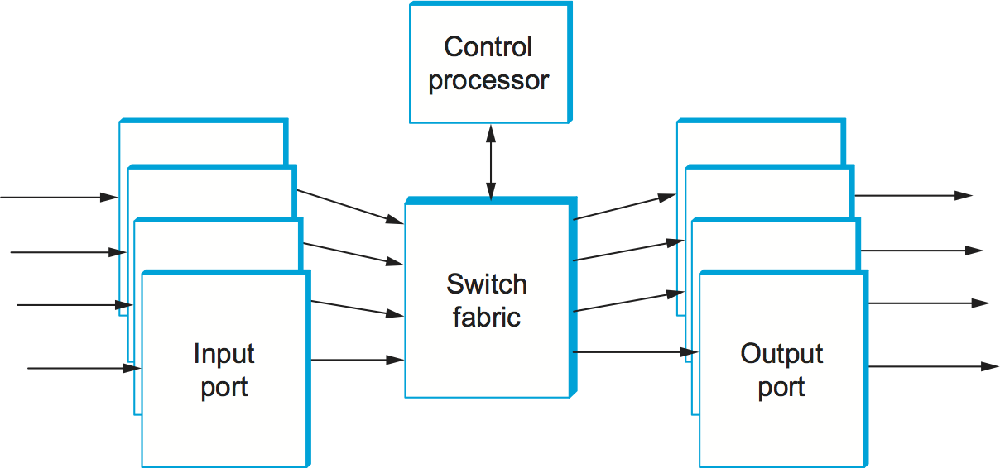
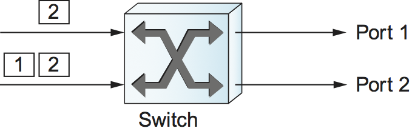
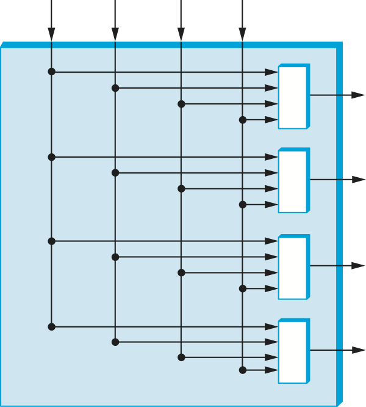
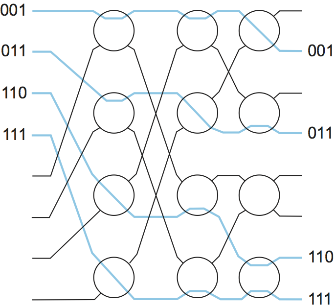

# {{Paj.Toe}}

到目前为止,我们已经讨论了交换机和路由器必须做什么而不讨论如何去做. 构建交换机或路由器有一个非常简单的方法: 购买一个通用处理器,并为它配备许多网络接口. 这样的设备运行适当的软件,可以在其接口之一上接收分组,执行上述任何交换或转发功能,并且从其另一个接口发送分组. 实际上,这是在您想要开发新的路由协议时构建实验性路由器和交换机的流行方法,因为它提供了极大的灵活性和熟悉的编程环境. 它也不太远离许多商用中低端路由器的体系结构. 

## 交换基础

交换机和路由器使用类似的实现技术,因此我们将从研究这些常见技术开始本节,然后在下一节中继续研究影响路由器实现的具体问题. 在本节的大部分内容中,我们将使用这个词*转换*要覆盖这两种类型的设备,因为它们的内部设计是如此相似 (并且总是说"交换机或路由器"很乏味) . 

<figure class="line">
	
	
	<figcaption>A general-purpose processor used as a packet
	switch.</figcaption>
</figure>
	
[Figure 1](#softswitch) shows a processor with three network
interfaces used as a switch. The figure shows a path that a packet
might take from the time it arrives on interface 1 until it is output
on interface 2. We have assumed here that the processor has a
mechanism to move data directly from an interface to its main memory
without having to be directly copied by the CPU, a technique called
*direct memory access* (DMA). Once the packet is in memory, the CPU
examines its header to determine which interface the packet should be
sent out on. It then uses DMA to move the packet out to the
appropriate interface. Note that [Figure 1](#softswitch) does
not show the packet going to the CPU because the CPU inspects only the
header of the packet; it does not have to read every byte of data in
the packet.

使用通用处理器作为交换机的主要问题是,其性能受到所有分组必须通过单个争用点的事实的限制: 在所示的示例中,每个分组两次穿过I/O总线,一次写入主存储器并从主存储器读取. 因此,这种设备的总吞吐量的上限 (在所有输入上求和的总可持续数据速率) 是主存储器带宽的一半或I/O总线带宽的一半,以较小者为准.  (通常,它是I/O总线带宽. ) 例如,具有133MHzㄡ64位宽的I/O总线的机器可以以略高于8Gbps的峰值速率传输数据. 由于转发数据包涉及两次穿越总线,所以实际的限制是4Gbps-足以构建具有足够数量的100Mbps以太网端口的交换机,例如,但对于互联网核心中的高端路由器来说几乎不够. 

此外,这个上限还假设移动数据是唯一的问题ℴℴ对于长的分组是公平的近似,但是对于短的分组是坏的近似. 在后一种情况下,处理每个分组的成本ℴℴ解析其报头并决定在哪个输出链路上传输它ℴℴ很可能占主导地位. 例如,假设处理器可以执行所有必要的处理以每秒切换200万个分组. 这有时被称为每秒分组 (PPS) 率.  (这个数字代表在廉价PC上可以实现什么. ) 如果平均数据包很短,比如说64字节,这就意味着

吞吐量= PPS xByStPasks

$ $ = 2倍10 ^ 6次64次8 $$

$ 1024 = 10倍6 ^ $ $ $

也就是说,大约1 Gbps的吞吐量大大低于用户今天从他们的网络要求的范围. 请记住,这1Gbps将由连接到交换机的所有用户共享,就像连接到共享介质的所有用户共享单个 (未切换的) 以太网段的带宽一样. 因此,例如,具有这种总吞吐量的20端口交换机将只能处理每个端口上大约50Mbps的平均数据速率. 

为了解决这个问题,硬件设计人员提出了大量交换机设计,它们减少了争用量,并提供了较高的总吞吐量. 注意,某些争用是不可避免的: 如果每个输入都有数据要发送到单个输出,那么它们就不能同时发送数据. 然而,如果预定用于不同输出的数据到达不同的输入,那么设计良好的开关将能够将数据从输入并行地移动到输出,从而增加总吞吐量. 

<figure class="line">
	
	
	<figcaption>A 4 $$\times$$ 4 switch.</figcaption>
</figure>

## 端口

大多数交换机在概念上与所示的交换机相似. [图2](#portfab). 它们由若干个*输入*和*输出端口*和A*织物*. 通常至少有一个控制处理器负责整个交换机,该交换机直接或通过交换结构与端口通信,如这里所示. 港口与外界交流. 它们可以包括光纤接收器和激光器ㄡ用于保存等待交换或传输的分组的缓冲器,以及通常使开关能够工作的大量其他电路. 该结构有一个非常简单和明确定义的工作: 当呈现一个数据包时,将其传递到正确的输出端口. 

因此,端口的工作之一就是处理现实世界的复杂性,使得结构能够完成相对简单的工作. 例如,假设该开关支持通信的虚拟电路模型. 一般来说,虚拟电路映射表位于端口中. 端口维护当前使用的虚拟电路标识符的列表,其中包含关于每个VCI应该发送什么数据包以及需要如何重新映射VCI以确保输出链路上的唯一性的信息. 类似地,以太网交换机的端口存储映射在以太网地址和输出端口 (桥接转发表) 之间的表. 一般来说,当分组从输入端口传递到结构时,端口已经计算出分组需要到哪里去,并且端口或者通过将一些控制信息传递到它来相应地建立结构,或者它向分组本身附加足够的信息 (例如,输出po) . RT数) 允许织物自动完成其工作. 仅通过查看包中的信息来交换分组的织物称为*自寻径*,因为它们不需要外部控制来路由分组. 下面讨论一个自路由结构的例子. 

输入端口是第一个寻找性能瓶颈的地方. 输入端口必须接收稳定的分组流,分析每个分组的报头中的信息,以确定必须向哪个输出端口 (或端口) 发送分组,并将分组传递到结构. 它执行的头部分析的类型可以从对VCI的简单表查找到检查头部中许多字段的复杂匹配算法. 这是当平均分组大小非常小时,有时会成为问题的操作类型. 例如,考虑到连接到OC-48 (2.48 Gbps) 链路的端口上的64字节分组. 这样的端口需要以一定的速率处理数据包. 

2.48美元\\ 10倍9 / (64倍8) =4.83倍10 ^ 6 PPS $ $

换言之,当小分组在这个链路上尽可能快地到达时(大多数端口被设计为处理的最坏情况),输入端口有大约200纳秒来处理每个分组. 

端口的另一个关键功能是缓冲. 观察缓冲可能发生在输入或输出端口;它也可以发生在织物内 (有时称为*内部缓冲*) 简单的输入缓冲有一些严重的局限性. 考虑一个实现为FIFO的输入缓冲区. 当分组到达交换机时,它们被放置在输入缓冲器中. 然后,交换机尝试将每个FIFO前端的数据包转发到合适的输出端口. 然而,如果位于多个不同输入端口前面的分组同时指向同一个输出端口,则只能转发其中的一个;其余的分组必须留在它们的输入缓冲区中. 

> 对于一个简单的输入缓冲开关,一次恰好一个数据包可以发送到给定的输出端口. 可以设计一种交换机,这种交换机可以以较高的交换机复杂度为代价,一次将一个以上的分组转发到相同的输出,但是这个数目总是存在一些上限. 

<figure class="line">
	
	
	<figcaption>Simple illustration of head-of-line blocking.</figcaption>
</figure>
	
 The drawback of this feature is that those packets left at the front of
the input buffer prevent other packets further back in the buffer from
getting a chance to go to their chosen outputs, even though there may be
no contention for those outputs. This phenomenon is called *head-of-line
blocking*. A simple example of head-of-line blocking is given in
[Figure 3](#hol), where we see a packet destined for port 1 blocked
behind a packet contending for port 2. It can be shown that when traffic
is uniformly distributed among outputs, head-of-line blocking limits the
throughput of an input-buffered switch to 59% of the theoretical maximum
(which is the sum of the link bandwidths for the switch). Thus, the
majority of switches use either pure output buffering or a mixture of
internal and output buffering. Those that do rely on input buffers use
more advanced buffer management schemes to avoid head-of-line blocking.

缓冲区实际上比执行等待发送的数据包执行更复杂的任务. 缓冲区是交换机中延迟的主要来源,也是分组由于缺乏存储空间而最有可能丢失的地方. 因此,缓冲器是确定开关的服务质量特性的主要场所. 例如,如果某个包已经沿着VC发送,并且具有保证的延迟,那么它就不能长期处于缓冲区中. 这意味着,通常必须使用满足广泛QoS要求的分组调度和丢弃算法来管理缓冲区. 

## 织物

虽然已经有大量令人印象深刻的研究进行了有效和可伸缩的织物的设计,但它足以为我们的目的在这里只了解交换结构的高级性能. 交换结构应该能够以最小的延迟和满足交换机的吞吐量目标的方式将分组从输入端口移动到输出端口. 这通常意味着织物表现出一定程度的平行度. 具有n个端口的高性能结构通常可以同时将一个分组从其n个端口移动到其中一个输出端口. 织物类型的样品包括: 

<figure class="line">
	
	
	<figcaption>A 4 $$\times$$ 4 crossbar switch.</figcaption>
</figure>
	
- *Shared Bus*—This is the type of "fabric" found in a conventional
    processor used as a switch, as described above. Because the bus
    bandwidth determines the throughput of the switch, high-performance
    switches usually have specially designed busses rather than the
    standard busses found in PCs.

-   *共享内存*-在共享存储器交换机中,分组通过输入端口写入存储器位置,然后通过输出端口从存储器读取. 在这里,决定交换机吞吐量的是内存带宽,所以在这种设计中通常使用宽而快的存储器. 共享存储器交换机原理上类似于共享总线交换机,只是它通常使用专门设计的高速存储器总线而不是I/O总线. 

-   *横杆*交叉开关是可配置为将任何输入端口连接到任何输出端口的路径矩阵. [图4](#xbar)显示4 $ $\\ $ $ 4纵横交换机. 交叉开关的主要问题是,在最简单的形式中,它们要求每个输出端口能够一次接受来自所有输入的数据包,这意味着每个端口将具有等于总交换机吞吐量的内存带宽. 实际上,更复杂的设计通常用于解决这个问题 (例如,参见"进一步阅读"部分中的"敲出开关"和"McKe."的虚拟输出缓冲方法) . 

-   *自寻径*-如上所述,自路由结构依赖于分组报头中的一些信息来引导每个分组到其正确的输出. 通常,在输入端口确定数据包需要到达哪个输出之后,一个特殊的"自路由报头"被附加到数据包上,如下所示[图5](#self-route)这个额外的报头在分组离开交换机之前被删除. 自路由结构通常由大量以常规模式互连的非常简单的2$乘以$2交换元件构成,例如*榕树*交换结构显示在[图6](#banyaneg).

<figure class="line">
	
	
	<figcaption>A self-routing header is applied to a packet at input
	to enable the fabric to send the packet to the correct output,
	where it is removed: (a) Packet arrives at input port; (b) input
	port attaches self-routing header to direct packet to correct
	output; (c) self-routing header is removed at output port before
	packet leaves switch.</figcaption>	
</figure>
	
<figure class="line">
	
	
	<figcaption>Routing packets through a banyan network. The 3-bit
	numbers represent values in the self-routing headers of four
	arriving packets.</figcaption>
</figure>
	
 Self-routing fabrics are among the most scalable approaches to fabric
design, and there has been a wealth of research on the topic, some of
which is listed in the Further Reading section. Many self-routing
fabrics resemble the one shown in [Figure 6](#banyaneg), consisting
of regularly interconnected 2 $$\times$$ 2 switching elements. For example,
the 2 $$\times$$ 2 switches in the banyan network perform a simple task:
They look at 1 bit in each self-routing header and route packets toward
the upper output if it is zero or toward the lower output if it is one.
Obviously, if two packets arrive at a banyan element at the same time
and both have the bit set to the same value, then they want to be routed
to the same output and a collision will occur. Either preventing or
dealing with these collisions is a main challenge for self-routing
switch design. The banyan network is a clever arrangement of
2 $$\times$$ 2 switching elements that routes all packets to the correct
output without collisions if the packets are presented in ascending
order.

我们可以在一个例子中看到它是如何工作的,如[图6](#banyaneg),其中自路由头包含二进制编码的输出端口号. 第一列中的开关元件查看输出端口号的最高有效位,如果该位是0,则将分组路由到顶部,如果该位是1,则将分组路由到底部. 第二列中的switch元素查看标题中的第二位,最后一列中的switch元素查看最低有效位. 从这个例子中可以看出,分组在没有冲突的情况下被路由到正确的目的地端口. 请注意第一列交换机的顶部输出如何都指向网络的上半部,从而将端口号为0到3的分组发送到网络的右半部. 下一列获取数据包到网络的右四分之一,最后一列将它们送到正确的输出端口. 巧妙的部分是开关被安排以避免碰撞的方式. 部分的安排包括在网络开始时的"完美混洗"布线模式. 为了围绕榕树网络构建完整的交换结构,在将分组呈现给榕树之前,需要额外的组件对分组进行排序. Batcher榕树开关设计是这种方法的一个显著例子. Batcher网络也是由2$乘以$2交换元素的常规互连构建的,它将分组按降序排序. 离开Batcher网络后,分组就准备好被banyan网络引导到正确的输出,而不存在冲突的风险. 

开关设计的一个有趣之处在于,可以使用相同的基本技术构建各种不同类型的开关. 例如,下面讨论的以太网交换机ㄡATM交换机和因特网路由器都是使用本节中概述的设计构建的. 

## 路由器实现

现在我们已经看到了构建交换机的各种方法,从具有适当数量的网络接口的通用处理器到一些复杂的硬件设计. 一般来说,同样的选项可以用于构建路由器,其中很多看起来都是类似的. [图7](#router-imp). 控制处理器负责运行上面讨论的路由协议,并且通常充当路由器的中心控制点. 交换结构将分组从一个端口传输到另一个端口,就像在交换机中一样;端口提供一系列功能以允许路由器与各种类型的链路 (例如,以太网ㄡSONET) 接口. 

<figure class="line">
	
	
	<figcaption>Block diagram of a router.</figcaption>
</figure>
	
 A few points are worth noting about router design and how it differs
from switch design. First, routers must be designed to handle
variable-length packets, a constraint that does not apply to ATM
switches but is certainly applicable to Ethernet or Frame Relay
switches. It turns out that many high-performance routers are designed
using a switching fabric that is cell based. In such cases, the ports
must be able to convert variable-length packets into cells and back
again. This is known as *segmentation and re-assembly* (SAR), a problem
also faced by network adaptors for ATM networks.

IP数据报长度可变的另一个结果是,与只转发小区的交换机相比,很难描述路由器的性能. 路由器通常可以每秒转发一定数量的数据包,这意味着总吞吐量在*位*每秒钟取决于数据包的大小. 路由器设计者通常必须对它们将支持的数据包长度做出选择. *线率*. 即,如果"pps"(每秒分组)是到达特定端口的分组能够被转发的速率,而"linerate"是端口的物理速度,以比特每秒为单位,那么在比特中将会有一些"分组大小",使得: 

 PACETSIZE X PPS=文件名

这是路由器能够以行速率转发的分组大小;对于较长的分组,它可能能够维持行速率,但对于较短的分组则不能. 有时,设计者可能会决定要支持的正确的分组大小是40字节,因为这是附加了TCP报头的IP分组的最小大小. 另一种选择可能是预期的. *平均的*分组大小,可以通过研究网络流量的轨迹来确定. 例如,因特网骨干网的测量表明平均IP分组长约300字节. 然而,当面对长序列的短分组时,这样的路由器将落后,并且可能开始丢弃分组,这在统计上可能不时出现,而且如果路由器受到主动攻击,也是非常可能的. 这种类型的设计决策很大程度上取决于成本考虑和路由器的预期应用. 

当涉及到转发IP分组的任务时,路由器可以概括为具有*集中式*或*分布式的*转发模型. 在集中式模型中,本章前面概述的IP转发算法是在处理来自所有端口的流量的单个处理引擎中完成的. 在分布式模型中,有几个处理引擎,也许每个端口一个,或者更经常地每个线路卡一个,其中线路卡可以为一个或多个物理端口服务. 每个模型都有优点和缺点. 在所有条件都相同的情况下,分布式转发模型应该能够从整体上通过路由器每秒转发更多的分组,因为总的来说具有更大的处理能力. 但是分布式模型也使软件体系结构复杂化,因为每个转发引擎通常需要其自身的转发表的副本,因此控制处理器必须确保转发表被一致地和及时地更新. 

路由器实现的另一个显著不同于交换机的方面是IP转发算法本身. 在桥接器和大多数ATM交换机中,转发算法仅涉及查找表中的固定长度标识符 (MAC地址或VCI) ,查找表中的正确输出端口,并将分组发送到该端口. 我们已经看到,IP转发算法比这稍微复杂一些,部分原因是在转发分组时需要检查的相关位数不是固定的,而是可变的,通常从8位到32位不等. 

由于IP转发算法的复杂度相对较高,所以有时IP路由器似乎会遇到性能上的基本上限. 然而,正如我们在本章的进一步阅读部分所讨论的,多年来已经发展了许多创新的IP转发方法,并且在撰写本文时,有一些商业路由器可以转发40Gbps的IP流量. *每个接口*. 通过将许多这样的高性能IP转发引擎与那种可伸缩的开关结构相结合,现在可以构建具有许多T比特的总吞吐量的路由器. 这足以让我们看到未来几年互联网流量的增长. 

路由器实现领域中的另一个有意义的技术是*网络处理器*. 网络处理器旨在成为与标准PC处理器一样可编程的设备,但是对于联网任务来说,它更加优化. 例如,网络处理器可能具有特别适合于对IP地址执行查找或对IP数据报计算校验和的指令. 这样的设备可以用于路由器和其他网络设备 (例如防火墙) . 

关于网络处理器的一个有趣的和正在进行的争论是,他们是否能比替代方案做得更好. 例如,鉴于传统处理器的性能持续显著改善,以及推动这些改进的巨大产业,网络处理器能跟上吗?一个追求通用性的设备能像定制设计的专用集成电路 (ASIC) 一样出色吗?这些问题的部分答案取决于你所说的"做得更好"的意思. 它是建成的. 我们将在后面的章节中看到路由器功能的需求是多么的多样化. 可以安全地假定,在可预见的将来将存在广泛的路由器设计,并且网络处理器将发挥一些作用. 
