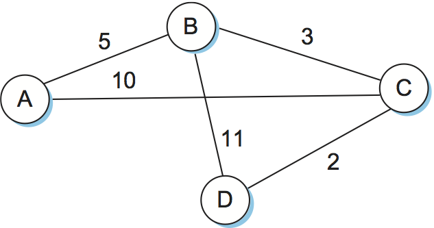

# {{Paj.Toe}}

到目前为止,在本章中,我们假设交换机和路由器具有足够的网络拓扑知识,因此它们可以选择每个分组应该输出到哪个端口. 在虚拟电路的情况下,路由仅是连接请求分组的问题;所有后续分组都遵循与请求相同的路径. 在数据包网络中,包括IP网络,路由是每个包的问题. 无论哪种情况,交换机或路由器都需要能够查看目的地址,然后确定哪个输出端口是使分组到达该地址的最佳选择. 正如我们在前面的章节中看到的,交换机通过咨询转发表来做出这个决定. 路由的基本问题是交换机和路由器如何获取转发表中的信息. 

我们重申了一个重要的区别,常常被忽视. *转发*和*路由*. 转发包括获取数据包ㄡ查看其目的地址ㄡ查阅表,以及按照该表确定的方向发送数据包. 在前面的章节中我们看到了几个转发的例子. 路由是建立转发表的过程. 我们还注意到,转发是在节点本地执行的相对简单且定义良好的过程,而路由依赖于在整个网络历史中持续演进的复杂分布式算法. 

而术语*转发表*和*路由表*有时互换使用,我们将在这里区分它们. 转发表用于转发数据包,因此必须包含足够的信息来完成转发功能. 这意味着转发表中的一行包含从网络前缀到输出接口的映射以及一些MAC信息,例如下一跳的以太网地址. 另一方面,路由表是由路由算法构建的表,作为构建转发表的前身. 它通常包含从网络前缀到下一跳的映射. 它还可以包含关于如何学习该信息的信息,以便路由器能够决定何时应该丢弃一些信息. 

路由表和转发表实际上是否是分离的数据结构是一种实现选择,但是将它们分开的原因有很多. 例如,转发表需要被构造成在转发分组时优化查找地址的过程,而路由表需要被优化以便计算拓扑的变化. 在许多情况下,转发表甚至可以在专用硬件中实现,而很少对路由表这样做. [表1](#rtab-ftab)下面提供了来自每一种表的行的示例. 在这种情况下,路由表告诉我们,具有IP地址171.69.245.10的下一跳路由器将到达网络前缀18/8,而转发表则包含关于如何将分组转发到下一跳的确切信息: 发送具有MAC地址的接口号08:0:2B:E4:B:1:2. 注意,最后一条信息是由地址解析协议提供的. 

<a id="rtab-ftab"></a>

 (a) 

| Prefix/Length |    Next Hop   |
| :-----------: | :-----------: |
|      18/8     | 171.69.245.10 |

 (b) 

| Prefix/Length | Interface |   MAC Address   |
| :-----------: | :-------: | :-------------: |
|      18/8     |    if0    | 8:0:2b:e4:b:1:2 |

*表1.  (a) 路由和 (b) 转发表的示例行. *

在进入路由的细节之前,我们需要提醒自己,无论何时,当我们试图为互联网构建一个机制时,我们都应该问自己一个关键问题: "这个解决方案可伸缩吗?"本节中描述的算法和协议的答案是"不多". 实际上,它们是为规模相当小的网络设计的,最多有几百个节点. 然而,我们描述的解决方案确实充当了当今Internet中使用的分层路由基础结构的构建块. 具体地说,本节中描述的协议统称为*粘团内的*路由协议,或*内部网关协议* (IGPs) 为了理解这些术语,我们需要定义路由. *领域*. 一个好的工作定义是互联网,其中所有路由器都处于相同的管理控制之下 (例如,单个大学校园或单个互联网服务提供商的网络) . 这一定义的相关性将在下一章当我们看到的时候变得明显. *域间*路由协议. 现在,需要记住的重要事情是,我们正在考虑在小型到中型网络的上下文中进行路由的问题,而不是针对像因特网那么大的网络. 

## 网络作为图

路由在本质上是图论的一个问题. [图1](#graph-route)显示表示网络的图形. 图中的节点,标记为通过f,可以是主机ㄡ交换机ㄡ路由器或网络. 对于我们的初步讨论,我们将集中于节点是路由器的情况. 图的边对应于网络链路. 每个边都有关联*成本*这给出了在该链路上发送业务的可取性的一些指示. 关于边缘成本如何分配的讨论在后面的章节中给出. 

> 在本章使用的示例网络 (图) 中,我们使用无向边,并为每个边分配一个成本. 这实际上是一个简单的简化. 使边缘定向更精确,这通常意味着在每个节点之间有一对边缘,每个节点在每个方向上流动,并且每个节点都有自己的边缘成本. 

<figure class="line">
	<a id="graph-route"></a>
	
	<figcaption>Network represented as a graph.</figcaption>
</figure>
 	
The basic problem of routing is to find the lowest-cost path between any
two nodes, where the cost of a path equals the sum of the costs of all
the edges that make up the path. For a simple network like the one in
[Figure 1](#graph-route), you could imagine just calculating all the
shortest paths and loading them into some nonvolatile storage on each
node. Such a static approach has several shortcomings:

-   它不处理节点或链路故障. 

-   它不考虑添加新的节点或链接. 

-   这意味着边际成本不能改变,即使我们可能合理地希望链路成本随时间改变 (例如,将高成本分配给负载沉重的链路) . 

由于这些原因,在大多数实际网络中通过在节点之间运行路由协议来实现路由. 这些协议提供了一种分布式ㄡ动态的方法来解决在存在链路和节点故障以及边际成本变化的情况下寻找最低成本路径的问题. 注意单词*分布式的*在前面的句子中,很难使集中式解决方案可伸缩,所以所有广泛使用的路由协议都使用分布式算法. 

路由算法的分布式特性是路由算法如此丰富的研究和开发领域的主要原因之一,使得分布式算法能够很好地工作存在许多挑战. 例如,分布式算法提高了两个路由器在同一时刻对到某个目的地的最短路径有不同的想法的可能性. 事实上,每个人可能认为另一个更接近目的地并决定发送数据包到另一个目的地. 显然,这样的数据包将陷入一个循环中,直到两个路由器之间的差异得到解决,并且最好尽快解决它. 这只是问题路由协议必须解决的一个例子. 

为了开始我们的分析,我们假设网络中的边缘成本是已知的. 我们将研究路由协议的两大类: *距离向量*和*链路状态*. 在后面的部分中,我们将以一种有意义的方式返回计算边缘成本的问题. 

## 距离向量 (RIP) 

距离矢量算法的思想是由它的名字提出的.  (这一类算法的另一个通用名称是Bellman-Ford,以它的发明者命名. ) 每个节点构造一个一维数组 (向量) ,该数组包含到所有其他节点的"距离" (成本) ,并将该向量分配给其直接邻居. 距离向量路由的起始假设是每个节点知道到其每个直接连接的邻居的链路的成本. 当路由器由网络管理器配置时,可以提供这些成本. 向下链接的链接被分配一个无限的成本. 

<figure class="line">
	<a id="dvroute"></a>
	
	<figcaption>Distance-vector routing: an example network.</figcaption>
</figure>
	
<a id="dvtab1"></a>

|     |      A      |      B      |      C      |      D      |      E      |      F      |      G      |
| :-: | :---------: | :---------: | :---------: | :---------: | :---------: | :---------: | :---------: |
|  A  |      0      |      1      |      1      | $$\\infty$$ |      1      |      1      | $$\\infty$$ |
|  B  |      1      |      0      |      1      | $$\\infty$$ | $$\\infty$$ | $$\\infty$$ | $$\\infty$$ |
|  C  |      1      |      1      |      0      |      1      | $$\\infty$$ | $$\\infty$$ | $$\\infty$$ |
|  D  | $$\\infty$$ | $$\\infty$$ |      1      |      0      | $$\\infty$$ | $$\\infty$$ |      1      |
|  E  |      1      | $$\\infty$$ | $$\\infty$$ | $$\\infty$$ |      0      | $$\\infty$$ | $$\\infty$$ |
|  F  |      1      | $$\\infty$$ | $$\\infty$$ | $$\\infty$$ | $$\\infty$$ |      0      |      1      |
|  G  | $$\\infty$$ | $$\\infty$$ | $$\\infty$$ |      1      | $$\\infty$$ |      1      |      0      |

*表2. 存储在每个节点上的初始距离 (全局视图) . *

要了解距离向量路由算法是如何工作的,最容易考虑的例子是[图2](#dvroute). 在这个例子中,每个链路的成本被设置为1,因此最小代价路径仅仅是最少跳数的路径.  (因为所有边具有相同的成本,因此我们不在图表中显示成本. ) [表2](#dvtab1). 注意,每个节点只知道表的一行中的信息 (在左边列中包含它的名称) . 这里给出的全局视图在网络中的任何单个点上都不可用. 

我们可以考虑每一行[表2](#dvtab1)作为从一个节点到所有其他节点的距离的列表,表示该节点的当前信念. 最初,每个节点将其1的成本设置为其直接连接的邻居和$$ftTi$$到所有其他节点. 因此,最初认为它可以达到B在一跳,D是不可达的. 存储在A处的路由表反映了这一组信念,并包括A将用于到达任何可到达节点的下一跳的名称. 最初,A的路由表看起来像[表3](#dvtab2).

<a id="dvtab2"></a>

| Destination |     Cost    | NextHop |
| :---------: | :---------: | :-----: |
|      B      |      1      |    B    |
|      C      |      1      |    C    |
|      D      | $$\\infty$$ |    —    |
|      E      |      1      |    E    |
|      F      |      1      |    F    |
|      G      | $$\\infty$$ |    —    |

*表3. 节点A上的初始路由表. *

距离向量路由的下一步是每个节点向其直接连接的邻居发送包含其个人距离列表的消息. 例如,节点F告诉节点A它能够以1成本到达节点G;A也知道它能够以1成本到达F,因此它加上这些成本以获得通过F达到G的成本. 类似地,A从C中获悉,D可以从C中得到,代价是1;它把这个加到达到C(1)的成本上,并且决定D可以通过C得到,代价是2,这比无穷大的旧成本要好. 同时,A从C获悉,从C可以以1英镑的价格到达B,因此得出结论,通过C到达B的成本是2. 由于这比到达B (1) 的当前成本更差,因此忽略了新的信息. 

在这一点上,A可以更新其路由表的成本和下跳的网络中的所有节点. 结果显示在[表4](#dvtab3).

<a id="dvtab3"></a>

| Destination | Cost | NextHop |
| :---------: | :--: | :-----: |
|      B      |   1  |    B    |
|      C      |   1  |    C    |
|      D      |   2  |    C    |
|      E      |   1  |    E    |
|      F      |   1  |    F    |
|      G      |   2  |    F    |

*表4. 节点A上的最终路由表. *

<a id="dvtab4"></a>

|     |  A  |  B  |  C  |  D  |  E  |  F  |  G  |
| :-: | :-: | :-: | :-: | :-: | :-: | :-: | :-: |
|  A  |  0  |  1  |  1  |  2  |  1  |  1  |  2  |
|  B  |  1  |  0  |  1  |  2  |  2  |  2  |  3  |
|  C  |  1  |  1  |  0  |  1  |  2  |  2  |  2  |
|  D  |  2  |  2  |  1  |  0  |  3  |  2  |  1  |
|  E  |  1  |  2  |  2  |  3  |  0  |  2  |  3  |
|  F  |  1  |  2  |  2  |  2  |  2  |  0  |  1  |
|  G  |  2  |  3  |  2  |  1  |  3  |  1  |  0  |

*表5. 存储在每个节点上的最终距离 (全局视图) . *

在没有任何拓扑改变的情况下,在每个节点具有完整的路由表之前,只需要在邻居之间进行少量的信息交换. 将一致的路由信息传递给所有节点的过程称为*汇聚*.[表5](#dvtab4)当路由收敛时,显示从每个节点到所有其他节点的最终成本集. 我们必须强调,网络中没有一个节点拥有这个表中的所有信息,每个节点只知道它自己的路由表的内容. 像这样的分布式算法的优点在于,它能够在没有任何集中式权限的情况下使所有节点实现对网络的一致视图. 

在我们讨论距离向量路由之前,有一些细节需要填写. 首先,我们注意到,给定节点决定向其邻居发送路由更新的情况有两种. 其中的一个情况是*周期性*更新. 在这种情况下,每个节点都会自动发送更新消息,即使没有发生任何变化. 这样可以让其他节点知道这个节点仍在运行. 它还确保他们不断获取信息,如果他们目前的路线变得不可行,他们可能需要. 这些定期更新的频率因协议而异,但通常为几秒到几分钟. 第二种机制,有时称为*触发的*更新,每当节点发现链路故障或从其邻居之一接收到导致其更改其路由表中的路由之一的更新时发生. 每当节点的路由表发生变化时,它就向其邻居发送更新,这可能导致它们的表发生变化,从而导致它们向邻居发送更新. 

现在考虑当链路或节点发生故障时会发生什么. 注意到的节点首先向其邻居发送新的距离列表,并且通常系统相当快地稳定下来到一个新的状态. 关于节点如何检测故障的问题,有几个不同的答案. 在一种方法中,节点通过发送控制分组并查看它是否接收到确认来持续测试到另一个节点的链接. 在另一种方法中,如果节点在最后几个更新周期中没有接收到预期的周期性路由更新,则它确定链路 (或链路另一端的节点) 已关闭. 

要理解当节点检测到链路故障时发生了什么,请考虑当F检测到其到G的链路失败时发生了什么. 首先,F将其新距离设置为G为无穷大,并将该信息传递给A. 由于A知道其到G的2跳路径是通过F,所以A还将其距离设置为G为无穷大. 然而,在C进行下一次更新时,A将了解到C具有到G的2跳路径. 因此,A将知道它可以通过C在3跳中到达G,这小于无穷大,因此A将相应地更新它的表. 当节点F向F通告这一点时,它将知道它能够以4到A的代价达到G,这比无穷远要小,并且系统将再次变得稳定. 

不幸的是,稍微不同的情况可以阻止网络的稳定. 例如,假设从A到E的链接下降. 在下一轮更新中,A表示到E的距离为无穷大,但是B和C表示2到E的距离. 根据事件的确切时间,可能发生以下情况: 节点B,在听说E可以从C到达2跳时,得出结论,它可以在3跳中到达E,并建议将此定义为A;节点A得出结论,它可以在4跳中到达E,并将其通告给C;节点C得出结论,它可以在5跳中到达E;等等. 这个周期只有当距离到达一些大到足以被认为是无穷大的数时才会停止. 同时,没有一个节点实际上知道E是不可到达的,并且网络的路由表不稳定. 这种情况被称为*计算到无穷*问题. 

这个问题有几个局部的解决方法. 第一种是使用一些相对较小的数作为无穷大的近似值. 例如,我们可能会决定通过某个网络的最大跳数永远不会超过16,因此我们可以选择16作为表示无穷大的值. 这至少限制了计算无穷大所需的时间. 当然,如果我们的网络发展到一些节点被分开超过16个跳数的话,它也会带来一个问题. 

一种改善路由稳定时间的技术称为*劈裂视界*. 其思想是,当节点向其邻居发送路由更新时,它不会将从每个邻居学到的那些路由发送回该邻居. 例如,如果B在其表中具有路由 (E,2,A) ,那么它知道它一定已经从A学习了这条路由,因此每当B向A发送路由更新时,它在该更新中不包括路由 (E,2) . 在分裂地平线的更大变化中,被称为*毒物反转地平线*实际上,B将路由返回到A,但是它在路由中放置了否定信息,以确保A最终不会使用B到达E. 例如,B将路由 (E,$infty$$) 发送到A. 锿. 对于较大的路由循环,需要采取更严厉的措施. 继续上面的例子,如果B和C在听到从A到E的链接失败之后等了一会儿,他们就会发现它们都没有到E的路径. NE的关键优势在于其竞争对手,链路状态路由,后一节的主题. 

### 实施

实现这个算法的代码非常简单,这里只给出一些基础知识. 结构`Route`定义路由表中的每个条目,并且常数`MAX_TTL`指定一个条目在丢弃之前保留在表中的时间. 

```c
#define MAX_ROUTES      128     /* maximum size of routing table */
#define MAX_TTL         120     /* time (in seconds) until route expires */

typedef struct {
    NodeAddr  Destination;    /* address of destination */
    NodeAddr  NextHop;        /* address of next hop */
    int        Cost;          /* distance metric */
    u_short   TTL;            /* time to live */
} Route;

int      numRoutes = 0;
Route    routingTable[MAX_ROUTES];
```

基于新路由更新本地节点路由表的例程由`mergeRoute`. 虽然未显示,但计时器功能周期性地扫描节点路由表中的路由列表,递减`TTL` (时间) 每个路线的字段,并丢弃任何有0的时间的路线. 但是,注意`TTL`字段重置为`MAX_TTL`任何时候,由相邻节点的更新消息重新确认路由. 

```c
void
mergeRoute (Route *new)
{
    int i;

    for (i = 0; i < numRoutes; ++i)
    {
        if (new->Destination == routingTable[i].Destination)
        {
            if (new->Cost + 1 < routingTable[i].Cost)
            {
                /* found a better route: */
                break;
            } else if (new->NextHop == routingTable[i].NextHop) {
                /* metric for current next-hop may have changed: */
                break;
            } else {
                /* route is uninteresting---just ignore it */
                return;
            }
        }
    }
    if (i == numRoutes)
    {
        /* this is a completely new route; is there room for it? */
        if (numRoutes < MAXROUTES)
        {
            ++numRoutes;
        } else {
            /* can`t fit this route in table so give up */
            return;
        }
    }
    routingTable[i] = *new;
    /* reset TTL */
    routingTable[i].TTL = MAX_TTL;
    /* account for hop to get to next node */
    ++routingTable[i].Cost;
}
```

最后,程序`updateRoutingTable`是呼叫的主要程序`mergeRoute`将包含在从相邻节点接收到的路由更新中的所有路由合并. 

```c
void
updateRoutingTable (Route *newRoute, int numNewRoutes)
{
    int i;

    for (i=0; i < numNewRoutes; ++i)
    {
        mergeRoute(&newRoute[i]);
    }
}
```

### 路由信息协议 (RIP) 

IP网络中更广泛使用的路由协议之一是路由信息协议 (RIP) . 它在IP早期的广泛使用在很大程度上是由于它与流行的Unix的Berkeley Software Distribution(BSD)版本一起发布的事实,Unix的许多商业版本都是从该版本派生的. 它也非常简单. RIP是建立在刚才描述的距离向量算法上的路由协议的典型例子. 

互连网络中的路由协议与上面描述的理想化的图形模型略有不同. 在互连网中,路由器的目标是学习如何将数据包转发给各种不同的路由器. *网络*. 因此,路由器不是广告到达其他路由器的成本,而是宣传到达网络的成本. 例如,在[图3](#rip-eg)路由器C将向路由器A通告这样一个事实,即它能够以0美元到达网络2和3(它直接连接到网络),以1美元到达网络5和6,以2美元到达网络4. 

<figure class="line">
	<a id="rip-eg"></a>
	
	<figcaption>Example network running RIP.</figcaption>
</figure>
	
<figure class="line">
	<a id="rip"></a>
	
	<figcaption>RIPv2 packet format.</figcaption>
</figure>
 	
We can see evidence of this in the RIP (version 2) packet format in
[Figure 4](#rip). The majority of the packet is taken up with
`(address, mask, distance)` triples. However, the
principles of the routing algorithm are just the same. For example, if
router A learns from router B that network X can be reached at a lower
cost via B than via the existing next hop in the routing table, A
updates the cost and next hop information for the network number
accordingly.

RIP实际上是距离矢量路由的一种相当简单的实现. 运行RIP的路由器每30秒发送一次广告;每当来自另一路由器的更新导致它改变其路由表时,路由器也发送更新消息. 感兴趣的一点是它支持多个地址族,而不仅仅是IP. `Family`广告的一部分. RIP版本2(RIPv2)还引入了前面部分描述的子网掩码,而RIP版本1使用IP的旧分类地址. 

正如我们将在下面看到的,在路由协议中使用链路的不同度量或成本是可能的. RIP采用最简单的方法,所有的链路成本都等于1,就像我们上面的例子一样. 因此,它总是试图寻找最小跳数路由. 有效距离为1到15,16表示无穷远. 这也限制了RIP在相当小的网络上运行,这些网络的路径长度不超过15跳. 

## 链路状态 (OSPF) 

链路状态路由是内部网路由协议的第二大类. 链路状态路由的初始假设与距离向量路由的假设非常相似. 假设每个节点能够找出其邻居 (上下) 链路的状态和每个链路的成本. 再次,我们希望为每个节点提供足够的信息,使其能够找到到任何目的地的最低成本路径. 链路状态协议背后的基本思想非常简单: 每个节点都知道如何到达其直接连接的邻居,并且如果我们确保这些知识的全部被传播到每个节点,那么每个节点将具有足够的网络知识来构建完整的网络. 这显然是寻找网络中任意点的最短路径的充分条件 (虽然不是必要的条件) . 因此,链路状态路由协议依赖于两种机制: 链路状态信息的可靠传播,以及根据所有累积的链路状态知识的总和来计算路由. 

### 可靠的洪水

*可靠的洪水*是确保参与路由协议的所有节点从所有其他节点获得链路状态信息的副本的过程. 作为术语*泛滥的*建议的基本思想是,节点在其所有直接连接的链路上发送其链路状态信息;接收此信息的每个节点然后将其转发到所有直接连接的链路上*它的*链接. 这个过程一直持续到信息到达网络中的所有节点为止. 

更确切地说,每个节点创建更新包,也称为更新包. *链路状态报文* (LSP) ,包含以下信息: 

-   创建LSP的节点的ID

-   该节点的直接连接邻居列表,每个链接的成本

-   序列号

-   这个包裹的生存时间

前两项用于启用路由计算;后两项用于使向所有节点泛洪数据包的过程可靠. 可靠性包括确保您拥有信息的最新副本,因为可能存在来自穿越网络的一个节点的多个ㄡ矛盾的LSP. 可靠地证明洪水是相当困难的.  (例如,ARPANET中使用的链路状态路由的早期版本导致网络在1981中失败) . 

洪水以下列方式工作. 首先,像在可靠的链路层协议中一样,使用确认和重传使得相邻路由器之间的LSP传输是可靠的. 然而,需要更多的步骤来可靠地向网络中的所有节点洪泛LSP. 

考虑一个节点X,它接收源自某个其他节点Y的LSP的副本. 注意,Y可以是与X.X检查相同的路由域中的任何其他路由器,以查看它是否已经存储了来自Y的LSP的副本. 如果它已经有一个副本,它将比较序列号;如果新的LSP具有更大的序列号,则假定它是最近的,并且存储LSP,替换旧的LSP. 较小 (或相等) 的序列号意味着LSP比存储的LSP老 (或不新) ,因此它将被丢弃,并且不需要进一步的操作. 如果接收的LSP是较新的LSP,则X将LSP的副本发送给除了刚刚接收LSP的邻居之外的所有邻居. LSP没有被发送回接收到的节点的事实有助于结束LSP的泛滥. 由于X将LSP传递给它的所有邻居,然后这些邻居转身做同样的事情,所以LSP的最新副本最终到达所有节点. 

<figure class="line">
	<a id="flood"></a>
	
	<figcaption>Flooding of link-state packets: (a) LSP arrives at
	node X; (b) X floods LSP to A and C; (c) A and C flood LSP to B
	(but not X); (d) flooding is complete.</figcaption>
</figure>
 	
[Figure 5](#flood) shows an LSP being flooded in a small
network. Each node becomes shaded as it stores the new LSP. In
[Figure 5(a)](#flood) the LSP arrives at node X, which sends it to
neighbors A and C in [Figure 5(b)](#flood). A and C do not send it back
to X, but send it on to B. Since B receives two identical copies of
the LSP, it will accept whichever arrived first and ignore the second
as a duplicate. It then passes the LSP onto D, which has no neighbors
to flood it to, and the process is complete.

正如RIP一样,每个节点都在两种情况下生成LSP. 无论是周期性定时器的到期,还是拓扑结构的改变,都会导致节点产生新的LSP. 然而,节点生成LSP的惟一基于拓扑的原因是其直接连接的链路之一或直接相邻的链路发生故障. 链路的故障可以通过链路层协议在某些情况下检测到. 使用周期性的"hello"包可以检测到邻居的灭亡或邻居的连接丢失. 每个节点以定义的间隔将它们发送给它的直接邻居. 如果经过了足够长的时间而没有收到邻居的"hello",则到该邻居的链接将被向下声明,并且将生成新的LSP以反映这一事实. 

链路状态协议泛洪机制的一个重要设计目标是,必须尽可能快地将最新信息泛洪到所有节点,而旧的信息必须从网络中移除而不允许流通. 此外,显然希望最小化围绕网络发送的路由通信量的总量;毕竟,从实际使用网络进行应用程序的人的角度来看,这只是开销. 下面几段描述了这些目标实现的一些方式. 

减少开销的一个简单方法是除非绝对必要,否则避免生成LSP. 这可以通过使用非常长的定时器来完成,这对于LSPs的周期性的产生来说通常是按小时的顺序进行的. 考虑到当拓扑结构改变时,泛洪协议是真正可靠的,所以可以安全地假设不需要经常发送表示"什么都没有改变"的消息. 

为了确保旧信息被更新的信息取代,LSP携带序列号. 每次节点生成一个新的LSP时,它将序列号递增1. 与协议中使用的大多数序列号不同,这些序列号不需要包装,因此字段需要非常大 (例如,64位) . 如果一个节点向下,然后返回,它以序列号0开始. 如果节点长时间停机,则该节点的所有旧LSP都将超时 (如下所述) ;否则,该节点最终将接收其自己的具有较高序列号的LSP的副本,然后可以递增该副本并将其作为自己的序列号使用. 这将确保它的新LSP取代了在节点下降之前遗留下来的任何LSP. 

LSP也有一定的生存时间. 这用于确保旧链路状态信息最终从网络中删除. 节点总是将新接收的LSP的TTL减量,然后将其洪泛到其邻居. 它还"LSE"存储在节点中的LSP. 当TTL达到0时,节点用TTL为0重新循环LSP,该TTL被网络中的所有节点解释为删除该LSP的信号. 

### 路由计算

一旦给定节点具有来自所有其他节点的LSP的副本,它就能够计算网络的拓扑的完整映射,并且从这个映射能够决定到每个目的地的最佳路由. 那么,问题就在于它是如何从这些信息中计算出路线的. 该解决方案是基于著名的算法从图论Dijkstra的最短路径算法. 

首先定义了图论中的Dijkstra算法. 假设一个节点获取它已经接收的所有LSP,并构造网络的图形表示,其中N表示图中的节点集,l(i,j)表示与节点i,j之间的边相关联的非负成本(权重),在N和l(i,j)=$infty$,如果没有边锥在下面的描述中,我们让s在N中表示这个节点,即执行算法以找到N中所有其他节点的最短路径的节点. C (n) 表示从S到每个节点n的路径的成本. 给定这些定义,算法定义如下: 

```pseudo
M = {s}
for each n in N - {s}
    C(n) = l(s,n)
while (N != M)
    M = M + {w} such that C(w) is the minimum for all w in (N-M)
    for each n in (N-M)
    C(n) = MIN(C(n), C(w)+l(w,n))
```

基本上,算法工作如下. 我们从包含这个节点的M开始,然后使用直接连接的节点的已知成本将成本表 (C(n)s) 初始化为其他节点. 然后,我们寻找以最低成本(w)可到达的节点,并将其添加到M. 最后,我们通过考虑通过w到达节点的成本来更新成本表. 从源到w然后跟随从w到n的链路比我们必须到n的旧路由要少. 重复这个过程,直到所有的节点都合并在M中. 

实际上,每个交换机直接从它收集的LSP计算它的路由表,使用Dijkstra算法的实现,称为*前向搜索*算法. 具体来说,每个交换机维护两个列表,称为`Tentative`和`Confirmed`. 这些列表中的每一个都包含窗体的一组条目. `(Destination, Cost, NextHop)`. 该算法的工作原理如下: 

1.  初始化`Confirmed`为自己列出一个条目;这个条目的成本是0. 

2.  对于刚刚添加到节点的`Confirmed`在前一步骤中,将其称为节点`Next`并选择其LSP. 

3.  对于每个邻居 (`Neighbor`的) `Next`计算成本 (`Cost`为了达到这个目的`Neighbor`作为从我自己到的成本的总和`Next`从`Next`到`Neighbor`.

    1.  如果`Neighbor`目前不在`Confirmed`也不`Tentative`列表,然后添加`(Neighbor, Cost, NextHop)`到`Tentative`列表,在哪里`NextHop`是我到达的方向`Next`.

    2.  如果`Neighbor`目前正在`Tentative`列表,以及`Cost`低于当前上市成本`Neighbor`然后替换当前条目`(Neighbor, Cost, NextHop)`在哪里`NextHop`是我到达的方向`Next`.

4.  如果`Tentative`列表是空的,停止. 否则,从`Tentative`列表以最低的成本,移动到`Confirmed`列表,并返回到步骤2. 

<figure class="line">
	<a id="lsroute"></a>
	
	<figcaption>Link-state routing: an example network.</figcaption>
</figure>
 	
This will become a lot easier to understand when we look at an example.
Consider the network depicted in [Figure 6](#lsroute). Note that,
unlike our previous example, this network has a range of different edge
costs. [Table](#ls-trace) traces the steps for building the routing
table for node D. We denote the two outputs of D by using the names of
the nodes to which they connect, B and C. Note the way the algorithm
seems to head off on false leads (like the 11-unit cost path to B that
was the first addition to the `Tentative` list) but ends up with the
least-cost paths to all nodes.

<a id="ls_trace"></a>

| Step |             Confirmed             |     Tentative    | Comments                                                                                                                                        |
| :--: | :-------------------------------: | :--------------: | :---------------------------------------------------------------------------------------------------------------------------------------------- |
|   1  |              (D,0,--)             |                  | Since D is the only new member of the confirmed list, look at its LSP.                                                                          |
|   2  |              (D,0,--)             | (B,11,B) (C,2,C) | D's LSP says we can reach B through B at cost 11, which is better than anything else on either list, so put it on `Tentative` list; same for C. |
|   3  |          (D,0,--) (C,2,C)         |     (B,11,B)     | Put lowest-cost member of `Tentative` (C) onto `Confirmed` list. Next, examine LSP of newly confirmed member (C).                               |
|   4  |          (D,0,--) (C,2,C)         | (B,5,C) (A,12,C) | Cost to reach B through C is 5, so replace (B,11,B). C's LSP tells us that we can reach A at cost 12.                                           |
|   5  |      (D,0,--) (C,2,C) (B,5,C)     |     (A,12,C)     | Move lowest-cost member of `Tentative` (B) to `Confirmed`, then look at its LSP.                                                                |
|   6  |      (D,0,--) (C,2,C) (B,5,C)     |     (A,10,C)     | Since we can reach A at cost 5 through B, replace the `Tentative` entry.                                                                        |
|   7  | (D,0,--) (C,2,C) (B,5,C) (A,10,C) |                  | Move lowest-cost member of `Tentative` (A) to `Confirmed`, and we are all done.                                                                 |

*表6. 建立Node D.路由表的步骤*

链路状态路由算法具有许多优点: 它已被证明能够快速稳定,不会产生很多流量,并且能够快速响应拓扑变化或节点故障. 在下侧,每个节点 (在网络中的每个其他节点中的一个LSP) 存储的信息量可能相当大. 这是路由的基本问题之一,也是可伸缩性更一般的问题的一个实例. 下一节将讨论特定问题 (每个节点可能需要的存储量) 和一般问题 (可伸缩性) 的一些解决方案. 

距离矢量和链路状态算法之间的差异可以归纳如下. 在距离向量中,每个节点只与其直接连接的邻居交谈,但是它告诉他们它所学到的一切 (即,与所有节点的距离) . 在链路状态中,每个节点与所有其他节点进行通信,但是它只告诉它们它确实知道的内容 (即,只有其直接连接的链路的状态) . 

### 开放式最短路径优先协议 (OSPF) 

最广泛使用的链路状态路由协议之一是OSPF. 第一个单词"Open"指的是它是一个开放的ㄡ非专有的标准,是在互联网工程任务组 (IETF) 的主持下创建的. "SPF"部分来自链路状态路由的替代名称. OSPF在上面描述的基本链路状态算法中添加了相当多的特征,包括以下内容: 

-   *路由消息的认证*-分布式路由算法的一个特点是它们将信息从一个节点分散到许多其他节点,因此整个网络可能受到来自一个节点的坏信息的影响. 出于这个原因,确保参与协议的所有节点都可以被信任是一个好主意. 验证路由消息有助于实现这一点. 早期版本的OSPF使用了一个简单的8字节密码进行身份验证. 这不是一种足够强的身份验证形式来防止专用的恶意用户,但是它减轻了错误配置或偶然攻击造成的一些问题.  (版本2中的RIP中添加了类似的身份验证形式) 随后添加了强密码验证. 

-   *附加层次*层次结构是使系统更具可扩展性的基本工具之一. OSPF通过允许将域划分为路由,将另一层层次结构引入路由. *地区*. 这意味着域内的路由器不一定需要知道如何到达该域内的每个网络ℴℴ它可能仅通过知道如何到达正确的区域就能够到达. 因此,必须向每个节点发送和存储的信息量减少. 

-   *负载均衡*-OSPF允许向同一地点的多条路由分配相同的成本,并将导致业务在这些路由上均匀分布,从而更好地利用可用的网络容量. 

<figure class="line">
	<a id="ospf"></a>
	
	<figcaption>OSPF header format.</figcaption>
</figure>
 	
There are several different types of OSPF messages, but all begin with
the same header, as shown in [Figure 7](#ospf). The `Version` field
is currently set to 2, and the `Type` field may take the values 1
through 5. The `SourceAddr` identifies the sender of the message, and
the `AreaId` is a 32-bit identifier of the area in which the node is
located. The entire packet, except the authentication data, is protected
by a 16-bit checksum using the same algorithm as the IP header. The
`Authentication type` is 0 if no authentication is used; otherwise, it
may be 1, implying that a simple password is used, or 2, which indicates
that a cryptographic authentication checksum is used. In the latter
cases, the `Authentication` field carries the password or cryptographic
checksum.

在五种OSPF消息类型中,类型1是"hello"消息,路由器将此消息发送到其对等方,以通知它们它仍然活着,并且如上所述连接. 其余类型用于请求ㄡ发送和确认链路状态消息的接收. OSPF链路状态消息的基本构建块是链路状态广告 (LSA) . 一个消息可能包含许多LSA. 我们在这里提供了LSA的一些细节. 

与任何网络间路由协议一样,OSPF必须提供关于如何到达网络的信息. 因此,OSPF必须提供比上面描述的基于简单图的协议更多的信息. 具体地,运行OSPF的路由器可以生成链路状态分组,该链路状态分组通告直接连接到该路由器的一个或多个网络. 此外,通过某个链路连接到另一路由器的路由器必须公布通过链路到达该路由器的成本. 这两种类型的广告对于使域中的所有路由器能够确定到达该域中的所有网络的成本以及每个网络的适当下一跳是必需的. 

<figure class="line">
	<a id="ospf-lsa"></a>
	
	<figcaption>OSPF link-state advertisement.</figcaption>
</figure>
 	
[Figure 8](#ospf-lsa) shows the packet format for a type 1 link-state
advertisement. Type 1 LSAs advertise the cost of links between routers.
Type 2 LSAs are used to advertise networks to which the advertising
router is connected, while other types are used to support additional
hierarchy as described in the next section. Many fields in the LSA
should be familiar from the preceding discussion. The `LS Age` is the
equivalent of a time to live, except that it counts up and the LSA
expires when the age reaches a defined maximum value. The `Type` field
tells us that this is a type 1 LSA.

在1型LSA中,`Link state ID`以及`Advertising router`字段是相同的. 每个都为创建LSA的路由器携带32位标识符. 虽然可以使用许多分配策略来分配这个ID,但重要的是它在路由域中是唯一的,并且给定路由器始终使用相同的路由器ID. 分配给该路由器的IP地址.  (记得路由器可能在每个接口上有不同的IP地址. ) 

这个`LS sequence number`如上所述,用于检测旧的或重复的LSA. 这个`LS checksum`与我们在其他协议中看到的其他类似,当然,它被用来验证数据没有被破坏. 它覆盖了数据包中的所有字段. `LS Age`因此,不必每次重新计算校验和. `LS Age`递增. `Length`是完整LSA的字节长度. 

现在我们得到实际的链路状态信息. 这是有点复杂的TOS (服务类型) 信息的存在. 忽略这一点,LSA中的每个链接都由A表示. `Link ID`一些`Link Data`和A`metric`. 这些字段中的前两个字段标识链接;这样做的一种常见方法是使用链接远端的路由器的路由器ID作为`Link ID`然后使用`Link Data`如果需要,在多个并行链接中消除歧义. 这个`metric`当然是链接的成本. `Type`例如,如果它是点到点的链接,那就告诉我们一些链接. 

TOS信息是为了允许OSPF根据其TOS字段中的值来选择不同的IP分组路由. 可以依据数据的TOS值来分配不同的度量,而不是向链接分配单个度量. 例如,如果我们的网络中有一个对延迟敏感的业务非常有利的链路,那么我们可以给它一个表示低延迟的TOS值的低度量,给其他业务一个高度量. 然后,OSPF会为那些将TOS字段设置为该值的数据包选择不同的最短路径. 值得注意的是,在写作的时候,这种能力还没有被广泛部署. 

## 韵律学

前面的讨论假设当执行路由算法时,链路成本或度量是已知的. 在本节中,我们将研究计算实践证明有效的链路成本的一些方法. 我们已经看到一个例子,这个例子相当合理而且非常简单,就是给所有链路分配一个成本1-那么成本最低的路线就是跳数最少的路线. 然而,这样的方法有几个缺点. 首先,它不会在延迟的基础上区分链接. 因此,具有250毫秒延迟的卫星链路看起来与具有1毫秒延迟的地面链路一样对路由协议具有吸引力. 第二,它不区分在容量基础上的路由,使得9.6kbps链路看起来就像45 Mbps链路一样好. 最后,它不根据链路的当前负载来区分链路,使得无法绕过过过载的链路进行路由. 事实证明,最后一个问题是最困难的,因为您试图以单个标量成本捕获链接的复杂和动态特性. 

ARPANET是许多不同的应用程序蟑螂连接成本计算的测试地.  (这里还演示了链路状态相对于距离向量路由的优越稳定性;最初的机制使用距离向量,而后来的版本使用链路状态. ) 下面的讨论跟踪了ARPANET路由度量的演变,并在此过程中进行了探索这是问题的微妙之处. 

最初的ARPANET路由度量度量度量测量了在每个链路上排队等待发送的分组数量,这意味着具有等待发送的10个分组的链路被分配比具有排队等待发送的5个分组的链路更大的成本权重. 然而,使用队列长度作为路由度量并不能很好地工作,因为队列长度是人为的负载度量,它把数据包移动到最短的队列而不是目的地,这种情况对于在杂货店里从一行跳到另一行的人来说太熟悉了. 更准确地说,原来的ARPANET路由机制没有考虑链路的带宽或延迟. 

ARPANET路由算法的第二版,有时称为*新型路由机制*将链路带宽和延迟考虑在内,并使用延迟而不是仅仅队列长度作为负载度量. 这是这样做的. 首先,每一个传入的数据包都有时间戳,其到达路由器的时间 (`ArrivalTime`) 它离开路由器的时间 (`DepartTime`也被记录下来. 第二,当从另一侧接收到链路级ACK时,节点计算该分组的延迟. 

```c
Delay = (DepartTime - ArrivalTime) + TransmissionTime + Latency
```

哪里`TransmissionTime`和`Latency`对链路进行静态定义,并分别捕获链路的带宽和延迟. 注意,在这种情况下,`DepartTime - ArrivalTime`表示由于负载而导致的数据包在节点中延迟 (排队) 的时间. 如果ACK没有到达,而是数据包超时,那么`DepartTime`重置为包的时间*重传*. 在这种情况下,`DepartTime - ArrivalTime`捕获链路的可靠性-分组的重传越频繁,链路的可靠性就越差,并且我们越想避免它. 最后,分配给每个链路的权重是从最近通过该链路发送的分组所经历的平均延迟导出的. 

虽然在原有机制上有所改进,但这种方法也存在很多问题. 在轻载下,它工作得相当好,因为延迟的两个静态因素支配了成本. 然而,在重载下,拥挤的链路将开始广告成本非常高. 这导致所有流量都离开该链路,使其空闲,因此它会宣传低成本,从而吸引回所有流量,等等. 这种不稳定性的影响是,在重负载下,许多链接实际上将花费大量时间空闲,这是在重负载下您最不希望看到的. 

另一个问题是链接值的范围太大. 例如,重载9.6 kbps链路看起来比轻载56 kbps链路要高127倍. 这意味着,路由算法将选择具有126跳轻载56kbps链路的路径,而不是1跳9.6kbps路径. 虽然从超载的线路中减少一些流量是个好主意,但是使它看起来如此不吸引人,以至于失去所有的流量是过度的. 使用126跳时,1跳将做的是一般的网络资源的不良使用. 此外,卫星链路受到不适当的惩罚,因此空闲的56kbps卫星链路看起来比空闲的9.6kbps地面链路昂贵得多,尽管前者会给高带宽应用提供更好的性能. 

第三种方法称为"修正的ARPAET路由度量",解决了这些问题. 主要的变化是显著压缩度量的动态范围,以考虑链接类型,并平滑度量随时间的变化. 

平滑通过几个机制来实现. 首先,将延迟测量转换为链路利用率,并将这个数字与上次报告的利用率进行平均,以抑制突然变化. 第二,对于度量从一个测量周期到下一个测量周期的变化有一个严格的限制. 通过平滑成本的变化,所有节点一次性放弃路由的可能性大大降低. 

动态范围的压缩是通过将测量的利用率ㄡ链接类型和链接速度馈入一个函数来实现的,该函数在[图9](#metric). 下面. 观察以下内容: 

<figure class="line">
	<a id="metric"></a>
	
	<figcaption>Revised ARPANET routing metric versus link
	utilization.</figcaption>
</figure>
	
- A highly loaded link never shows a cost of more than three times its
    cost when idle.

-   最贵的链接只不过是最便宜的七倍. 

-   高速卫星链路比低速陆地链路更具吸引力. 

-   成本是仅在中度到高负荷下的链路利用率的函数. 

所有这些因素都意味着,链接不太可能被普遍放弃,因为成本增加三倍可能使链接对某些路径不具有吸引力,而让其他路径保持最佳选择. 曲线中的斜率ㄡ偏移量和断点[图9](#metric)经过大量的试错,他们被仔细调整以提供良好的性能. 

我们结束讨论路由度量与现实的剂量. 在撰写本文时的大多数真实网络部署中,度量很少变化,甚至仅在网络管理员的控制下,而不是像上面描述的那样自动改变. 部分原因是传统观点认为动态变化的度量太不稳定,尽管这可能不一定是真的. 也许更重要的是,现在许多网络缺乏ARPANET中普遍存在的链路速度和延迟的巨大差异. 因此,静态度量是标准. 一种常用的设置度量的方法是使用常数乘以 (1/Link带宽) . 
