# {{Paj.Toe}}

在最简单的术语中,交换机是一种机制,它允许我们互连链路以形成更大的网络. 交换机是一种多输入多输出设备,它将数据包从一个输入端传送到一个或多个输出端. 因此,开关添加星形拓扑 (参见[图1](#star)到最后一章中建立的点对点链路ㄡ总线 (以太网) 和环形拓扑结构. 星型拓扑具有几个吸引人的特性: 

-   即使交换机具有固定数量的输入和输出,这限制了可以连接到单个交换机的主机数量,但是可以通过互连多个交换机来构建大型网络. 

-   我们可以使用点对点链路将交换机连接到主机和主机,这通常意味着我们可以建立大范围的网络. 

-   通过将其连接到交换机来向网络添加新主机并不一定会降低已经连接的其他主机的网络性能. 

<figure class="line">
	<a id="star"></a>
	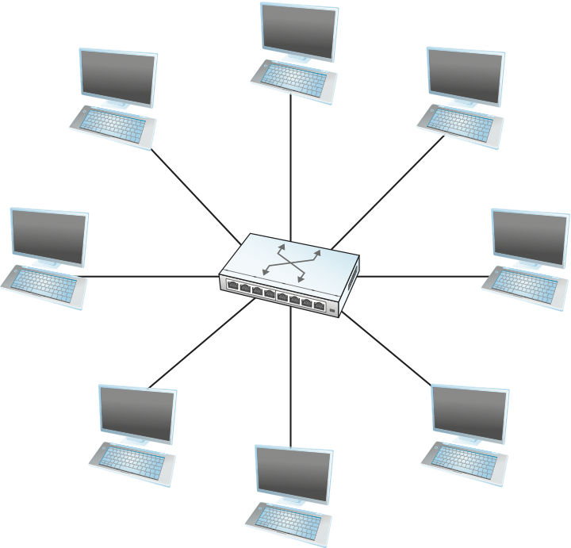
	<figcaption>A switch provides a star topology.</figcaption>
</figure>
  	
This last claim cannot be made for the shared-media networks discussed
in the last chapter. For example, it is impossible for two hosts on the
same 10-Mbps Ethernet segment to transmit continuously at 10 Mbps
because they share the same transmission medium. Every host on a
switched network has its own link to the switch, so it may be entirely
possible for many hosts to transmit at the full link speed (bandwidth),
provided that the switch is designed with enough aggregate capacity.
Providing high aggregate throughput is one of the design goals for a
switch; we return to this topic later. In general, switched networks are
considered more *scalable* (i.e., more capable of growing to large
numbers of nodes) than shared-media networks because of this ability to
support many hosts at full speed.

交换机连接到一组链路,并且对于这些链路中的每一个,运行适当的数据链路协议以与链路的另一端的节点通信. 交换机的主要工作是在其一个链路上接收传入的数据包,并将其传输到其他链路上. 这个函数有时也称为*切换*或*转发,*而在开放系统互连 (OSI) 体系结构中,它是网络层的主要功能. 

那么,问题是交换机如何决定将每个数据包放在哪一个输出链路上?一般的答案是,它查看包的标头,标明它用来做决定的标识符. 它如何使用这个标识符的细节各不相同,但有两种常见的方法. 第一个是*数据报*或*无连接的*方法. 第二个是*虚拟电路*或*面向连接*方法. 第三种方法,*源路由*与其他两个相比并不常见,但它确实有一些有用的应用. 

所有网络都有一个共同点,那就是我们需要有一种方法来识别端节点. 这种标识符通常称为*地址*. 我们已经看到了前面一章中的地址示例,例如用于以太网的48位地址. 对以太网地址的唯一要求是网络上没有两个节点具有相同的地址. 这是通过确保所有以太网卡被分配A来实现的. *全局唯一性*标识符. 对于下面的讨论,我们假设每个主机都有一个全局唯一的地址. 稍后,我们考虑地址可能有的其他有用属性,但全局唯一性足以让我们开始. 

我们需要做的另一个假设是,有一些方法来识别每个开关的输入和输出端口. 识别端口至少有两种明智的方法: 一种是给每个端口编号,另一种是通过它所引导的节点 (交换机或主机) 的名称来识别端口. 现在,我们使用端口编号. 

## 数据报

数据报背后的想法非常简单: 您只需在每个数据包中包括足够的信息,以使得任何交换机能够决定如何将其发送到目的地. 也就是说,每个包都包含完整的目的地地址. 考虑示例网络[图2](#dgram),其中主机有地址AㄡBㄡC等. 为了决定如何转发一个数据包,交换机咨询一个*转发表* (有时称为*路由表*) ,其中的一个例子被描述为[表1](#fwdtab). 该特定表显示了交换机2在示例网络中需要转发数据报的转发信息. 当具有如这里描述的简单网络的完整映射时,很容易找到这样的表;我们可以想象网络操作员静态地配置表. 在具有动态变化拓扑和目的地之间多条路径的大型复杂网络中创建转发表要困难得多. 那个更难的问题叫做*路由*这是后面一节的主题. 我们可以把路由看作是在后台发生的过程,这样,当一个数据包出现时,我们将在转发表中拥有正确的信息,以便能够转发或切换数据包. 

<figure class="line">
	<a id="dgram"></a>
	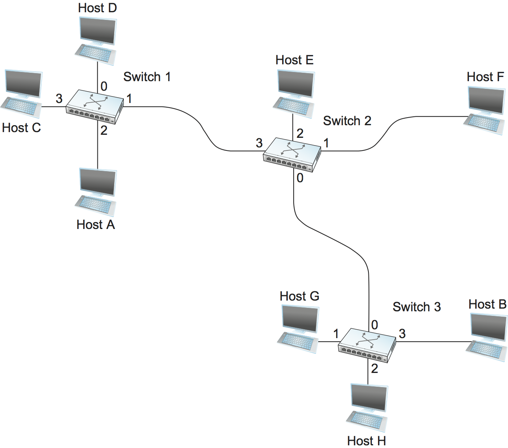
	<figcaption>Datagram forwarding: an example network.</figcaption>
</figure>

<a id="fwdtab"></a>

| 目的地 |  端口 |
| :-: | :-: |
|  一  |  三  |
|  乙  |  零  |
|  C  |  三  |
|  D  |  三  |
|  E  |  二  |
|  F  |  一  |
|  G  |  零  |
|  H  |  零  |

*表1. 交换机2的转发表. *

数据报网络具有以下特点: 

-   主机可以在任何时候在任何地方发送分组,因为在交换机上出现的任何分组都可以被立即转发 (假设有一个正确填充的转发表) . 由于这个原因,数据报网络经常被称为数据报网络. *无连接的*这与*面向连接*网络描述如下,其中一些*连接状态*需要在发送第一个数据包之前建立. 

-   当主机发送数据包时,它无法知道网络是否能够发送数据包,或者目标主机是否已经启动并运行. 

-   每个分组都独立于先前被发送到同一目的地的分组转发. 因此,从主机A到主机B的两个连续的分组可以遵循完全不同的路径 (可能是由于网络中某个交换机处的转发表发生了变化) . 

-   如果能够在故障周围找到替代路由并相应地更新转发表,则交换机或链路故障可能不会对通信产生严重影响. 

最后一个事实对数据报网络的历史尤为重要. Internet的一个重要设计目标是对故障的健壮性,并且历史已经证明它对于实现这个目标非常有效. 

## 虚拟电路交换

第二种与数据报模型显著不同的分组交换技术使用A的概念. *虚拟电路* (VC) . 这种方法,也称为*面向连接的模型*,需要在发送任何数据之前从源主机到目的主机建立虚拟连接. 要理解这是如何运作的,请考虑[图3](#vcircuit)在这里,主机A想把数据包发送给主机B. 我们可以认为这是一个两阶段的过程. 第一个阶段是"连接设置",第二个阶段是数据传输. 我们依次考虑每个问题. 

<figure class="line">
	<a id="vcircuit"></a>
	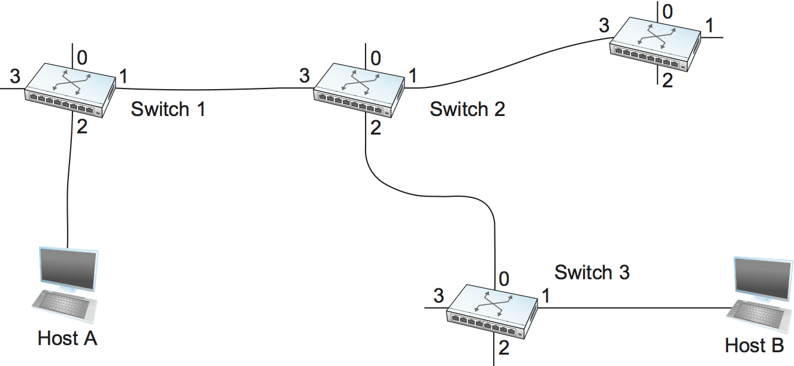
	<figcaption>An example of a virtual circuit network.</figcaption>
</figure>
	
In the connection setup phase, it is necessary to establish a
"connection state" in each of the switches between the source and
destination hosts. The connection state for a single connection consists
of an entry in a "VC table" in each switch through which the connection
passes. One entry in the VC table on a single switch contains:

-   一*虚电路标识符*(VCI)它唯一地标识这个交换机上的连接,并将被携带在属于这个连接的分组的头部中. 

-   一个传入的接口,在这个接口上,这个VC的数据包到达交换机. 

-   一个输出接口,在这个接口中,这个VC的数据包离开交换机. 

-   一种潜在的不同的VCI,将用于输出分组. 

一个这样的条目的语义如下: 如果一个包到达指定的传入接口,并且该包在其报头中包含指定的VCI值,那么该包应该在指定的传出接口中发送,而指定的传出VCI值是第一位的. 在它的头上. 

注意,在交换机接收到的数据包的VCI的组合. *和*它们所接收的接口唯一地标识虚拟连接. 当然,在一次交换机中建立了许多虚拟连接. 此外,我们观察到传入和传出的VCI值通常是不一样的. 因此,VCI不是连接的全局重要标识符;相反,它只在给定链路上有意义 (即,它具有*链路局部作用域*) 

每当创建新连接时,我们需要为连接将遍历的每个链接上的该连接分配一个新的VCI. 我们还需要确保在给定链路上选择的VCI当前没有在该链路上通过一些现有连接使用. 

有两种广泛的方法来建立连接状态. 一种是让网络管理员配置状态,在这种情况下,虚拟电路是"永久的". 当然,它也可以被管理员删除,所以永久虚拟电路 (PVC) 可能最好被认为是长寿的或管理配置的VC. 或者,主机可以将消息发送到网络中,从而建立状态. 这被称为*信令*所产生的虚拟电路被称为*转换*. 交换式虚拟电路 (SVC) 的显著特点是主机可以动态地建立和删除这样的VC,而无需网络管理员的参与. 请注意,SVC应该更准确地称为*发出信号的*VC,因为使用信令 (非交换) 来区分SVC和PVC. 

假设网络管理员想要手动创建从主机A到主机B的新的虚拟连接. [图3](#vcircuit)只有一条这样的路径,但一般情况并非如此. 然后管理员选择在连接的每个链路上当前未使用的VCI值. 为了我们示例的目的,假设VCI值5被选择用于从主机A到交换机1的链路,而11被选择用于从交换机1到交换机2的链路. 在这种情况下,交换机1需要在其VC表中配置一个条目,如图所示[表2](#vctab).

<a id="vctab"></a>

| 输入接口 | 输入VCI | 输出接口 | 传出VCI |
| :--: | :---: | :--: | :---: |
|   二  |   五   |   一  |   十一  |

*表2. 用于交换机1的示例虚拟电路表入口. *

类似地,假设选择7VCI来识别从交换机2到交换机3的链路上的这个连接,并且选择4VCI作为从交换机3到主机B的链路. [表3](#vctab1). 注意,在一个交换机上的"输出"VCI值是在下一个交换机上的"输入"VCI值. 

<a id="vctab1"></a>

交换机2的VC表项: 

| 输入接口 | 输入VCI | 输出接口 | 传出VCI |
| :--: | :---: | :--: | :---: |
|   三  |   十一  |   二  |   七   |

交换机3的VC表项: 

| 输入接口 | 输入VCI | 输出接口 | 传出VCI |
| :--: | :---: | :--: | :---: |
|   零  |   七   |   一  |   四   |

*表3. 用于交换机2和3的虚拟电路表项. *

<figure class="line">
	<a id="vcdat"></a>
	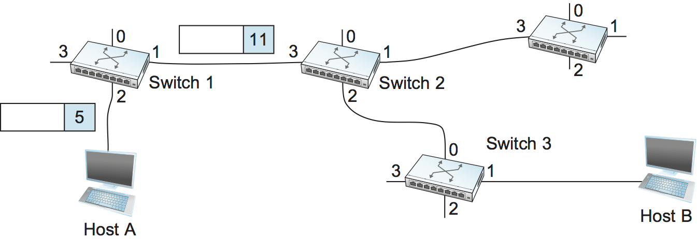
	<figcaption>A packet is sent into a virtual circuit network.</figcaption>
</figure>

一旦VC表已经建立,数据传输阶段可以继续进行,如[图4](#vcdat). 对于它想要发送给主机B的任何包,A将VCI值放在包的头5,并将其发送到交换机1. 交换机1在接口2上接收任何这样的分组,它使用接口和分组头中的VCI的组合来找到适当的VC表条目. 如图所示[表](#vctab)在这种情况下,表条目告诉交换机1将分组转发出接口1,并在发送分组时将VCI值11放入报头. 因此,该分组将到达包含VCI 11的接口3上的开关2. 开关2在其VC表中查找接口3和VCI 11 (如图所示) [表](#vctab1)) ,并在适当地更新分组报头中的VCI值之后,将该分组发送到交换机3,如图所示[图5](#vcdat2). 这个过程继续,直到它到达主机B,在包中VCI值为4. 对于主机B,它将数据包识别为来自主机A. 

在规模合理的实际网络中,使用上述过程在大量交换机中正确配置VC表的负担将很快变得过重. 因此,网络管理工具或某种信令 (或两者) 几乎总是被使用,甚至在建立"永久"VC时也是如此. 在PVC的情况下,信令由网络管理员发起,而SVC通常使用主机之一的信令建立. 现在我们考虑如何通过主机的信号建立刚才描述的同一VC. 

<figure class="line">
	<a id="vcdat2"></a>
	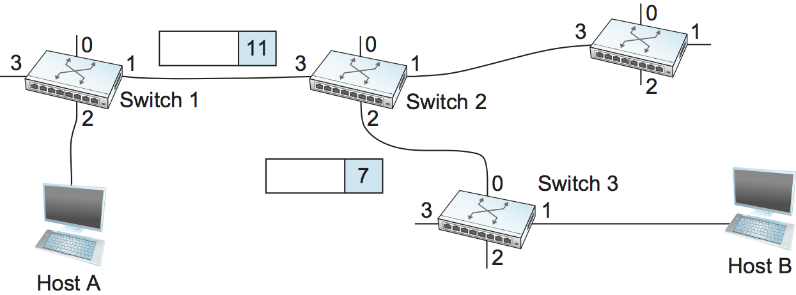
	<figcaption>A packet makes its way through a virtual circuit
	network.</figcaption>
</figure>
	
To start the signalling process, host A sends a setup message into the
network—that is, to switch 1. The setup message contains, among other
things, the complete destination address of host B. The setup message
needs to get all the way to B to create the necessary connection state
in every switch along the way. We can see that getting the setup message
to B is a lot like getting a datagram to B, in that the switches have to
know which output to send the setup message to so that it eventually
reaches B. For now, let's just assume that the switches know enough
about the network topology to figure out how to do that, so that the
setup message flows on to switches 2 and 3 before finally reaching
host B.

当交换机1接收到连接请求时,除了将其发送到交换机2之外,它还在其虚拟电路表中为这个新连接创建一个新条目. 此条目与前面所示完全相同. [表2](#vctab). 主要的区别在于,现在在接口上分配未使用的VCI值的任务由该端口的交换机执行. 在这个例子中,开关选择值5. 虚拟电路表现在具有以下信息: "当数据包到达带有标识符5的端口2时,将它们发送到端口1". 下面是PPENS. 

当交换机2接收到设置消息时,它执行类似的过程;在这个例子中,它选择值11作为传入的VCI值. 类似地,开关3选择7作为其传入VCI的值. 每个交换机可以选择它喜欢的任何号码,只要该号码当前没有用于该交换机端口上的其他连接. 如上所述,VCIS具有链路局部范围;也就是说,它们没有全局意义. 

最后,设置消息作为主机B到达. 假设B是健康的并且愿意接受来自主机A的连接,它也分配传入的VCI值,在本例中为4. 这个VCI值可以被B用来识别来自主机A的所有包. 

现在,为了完成连接,需要告诉每个人他们的下游邻居正在使用什么作为这个连接的VCI. 主机B发送连接建立的确认来切换3,并在该消息中包含它选择的VCI (4) . 现在交换机3可以完成这个连接的虚拟电路表条目,因为它知道输出值必须是4. 交换机3将确认发送到交换机2,指定VCI为7. 交换机2将消息发送到交换机1,指定VCI为11. 最后,交换机1将确认传递给主机A,告诉它使用这个连接的VCI 5. 

此时,每个人都知道允许通信量从主机A流到主机B所必需的一切. 每个交换机具有用于连接的完整虚拟电路表条目. 此外,主机A确认到主机B的所有步骤都已就位. 数据传送阶段的信令消息现在可以开始,与PVC案例中使用的相同. 

当主机A不再想将数据发送到主机B时,它通过向Twitter发送1的拆解消息来断绝连接. 交换机从其表中删除相关条目,并将消息转发到路径中的其他交换机,其他交换机同样删除适当的表条目. 此时,如果主机A要向交换机1发送VCI为5的分组,那么它将被丢弃,好像连接从未存在过. 

关于虚拟电路交换有几点需要注意: 

-   由于主机A必须等待连接请求到达网络的远端并返回才能发送其第一数据包,因此在发送数据之前至少有一个往返时间(RTT). 

-   虽然连接请求包含主机B的完整地址 (它可能非常大,是网络上的全局标识符) ,但是每个数据包仅包含一个小标识符,该标识符仅在一个链路上是唯一的. 因此,相对于报文模型,由报头引起的每包开销减少. 

-   如果连接中的交换机或链路失败,则连接中断,需要建立新的连接. 此外,旧的一个需要拆除,以解放表存储空间中的开关. 

-   交换机如何决定转发连接请求的哪一个链接的问题已经被解决了. 本质上,这是与建立数据报转发的转发表相同的问题,这需要某种类型的*路由算法*. 路由将在后面的部分中描述,这里描述的算法通常适用于路由设置请求和数据报. 

虚拟电路的一个很好的方面是,当主机获得发送数据的许可时,它已经对网络非常了解,例如,确实有到接收器的路径,并且接收器愿意并且能够接收数据. 还可以在虚拟电路建立时将资源分配给虚拟电路. 例如,X.25是一个早期的 (现在已经过时的) 基于虚拟电路的网络技术. X.25网络采用以下三个部分策略: 

1.  当电路初始化时,缓冲器被分配给每个虚拟电路. 

2.  滑动窗口协议沿着虚拟电路在每对节点之间运行,并且通过流控制来增强该协议,以防止发送节点超过在接收节点处分配的缓冲器. 

3.  当处理连接请求消息时,如果该节点没有足够的缓冲区可用,则该电路被给定节点拒绝. 

在这三件事情中,每个节点都确保有它需要的缓冲区来排队到达该电路的分组. 这种基本策略通常称为*逐跳流量控制. *

相比之下,数据报网络没有连接建立阶段,并且每个交换机独立地处理每个分组,使得数据报网络如何以有意义的方式分配资源变得不那么明显. 相反,每个到达的分组与缓冲空间的所有其他分组竞争. 如果没有空闲缓冲区,则必须丢弃传入的数据包. 然而,我们观察到,即使在基于数据报的网络中,源主机也经常向同一目标主机发送一系列数据包. 每个交换机可以基于源/目的地对来区分它当前排队的分组集合,因此交换机可以确保属于每个源/目的地对的分组正在接收交换机的缓冲器的公平份额. 

在虚拟电路模型中,我们可以想象为每个电路提供不同的电路. *服务质量* (QoS) 在此设置中,术语*服务质量*通常被理解为网络为用户提供了某种与性能相关的保证,这又意味着交换机留出了满足这种保证所需的资源. 例如,沿着给定虚拟电路的开关可能向该电路分配每个输出链路带宽的百分比. 作为另一个例子,交换机序列可以确保属于特定电路的分组不会被延迟 (排队) 超过一定时间. 

多年来,虚拟电路技术已经有许多成功的例子,特别是X.25ㄡ帧中继和异步传输模式 (ATM) . 然而,随着互联网的无连接模式的成功,他们中没有一个今天很受欢迎. 多年来虚拟电路最常见的应用之一是*虚拟专用网* (VPN) ,在后面的部分中讨论的主题. 甚至现在该应用大多使用基于互联网的技术来支持. 

### 异步传输模式 (ATM) 

异步传输模式 (ATM) 可能是最著名的基于虚拟电路的网络技术,尽管它现在在部署方面已经过了它的高峰. ATM在20世纪80年代和90年代初由于各种原因成为一项重要技术,其中最重要的是它被电话业所接受,而电话业历来在数据通信方面不那么活跃 (除了作为链接的供应商,其他人从它那里建立网络) . TWork) . ATM作为一种高速交换技术,恰好在诸如以太网和令牌环之类的共享媒体对许多计算机网络用户来说开始显得有点太慢时,才出现在现场. 在某些方面,ATM是一种与以太网交换相竞争的技术,许多人也将其视为IP的竞争对手. 

<figure class="line">
	<a id="atmcell"></a>
	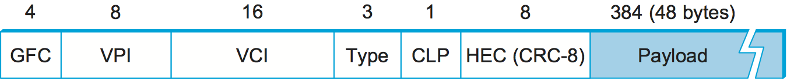
	<figcaption>ATM cell format at the UNI.</figcaption>
</figure>
	
There are a few aspects of ATM that are worth examining. The picture of
the ATM packet format—more commonly called an ATM *cell*—in
[Figure 6](#atmcell) will illustrate the main points. We'll skip the
generic flow control (GFC) bits, which never saw much use, and start
with the 24 bits that are labelled VPI (virtual path identifier—8
bits) and VCI (virtual circuit identifier—16 bits). If you consider
these bits together as a single 24-bit field, they correspond to the
virtual circuit identifier introduced above. The reason for breaking the
field into two parts was to allow for a level of hierarchy: All the
circuits with the same VPI could, in some cases, be treated as a group
(a virtual path) and could all be switched together looking only at the
VPI, simplifying the work of a switch that could ignore all the VCI bits
and reducing the size of the VC table considerably.

跳过最后一个头字节,我们发现一个8位循环冗余校验 (CRC) ,称为*标题错误检查* (`HEC`) 它使用CRC-8,并且仅在信元报头上提供错误检测和单比特纠错能力. 保护信元报头是特别重要的,因为`VCI`会导致细胞被误传. 

关于ATM信元,最值得注意的可能是,它被称为信元而不是分组的原因是它只有一个大小: 53字节. 这是什么原因?一个很大的原因是为了促进硬件交换机的实现. 当ATM在80年代中期和80年代被创建时,10 Mbps以太网是速度方面的尖端技术. 要走得更快,大多数人都是从硬件方面考虑的. 而且,在电话世界里,人们一想到交换机,就会想到很多ℴℴ电话交换机常常服务于成千上万的客户. 固定长度的数据包是一个非常有用的东西,如果你想建立快速,高度可扩展的交换机. 主要原因有两个: 

1.  构建硬件来完成简单的作业更容易,并且处理数据包的工作在您已经知道每个数据包将会有多长时间时更加简单. 

2.  如果所有包都具有相同的长度,那么可以让许多交换单元并行地执行许多相同的操作,每个交换单元花费相同的时间来完成其工作. 

第二个原因是并行性的实现,极大地提高了交换机设计的可扩展性. 如果只使用固定长度的单元构建快速并行硬件开关,这将夸大情况. 然而,信元确实减轻了构建这种硬件的任务,并且在定义ATM标准时,关于如何在硬件中构建信元交换机,有许多知识可用. 事实证明,同样的原理在今天的许多交换机和路由器中仍然适用,即使它们处理可变长度的分组ℴℴ它们将这些分组切成某种单元以便交换它们,正如我们将在后面的部分中看到的. 

决定使用小的固定长度的数据包后,下一个问题是修复它们的正确长度是多少?如果使它们太短,那么需要携带的头信息量相对于适合于一个单元格的数据量就会变大,因此实际用于携带数据的链路带宽的百分比就会下降. 更严重的是,如果构建一个以每秒最大单元数处理单元的设备,那么随着单元格变短,总数据速率与单元格大小成正比下降. 这种设备的一个例子可能是网络适配器,它把单元重新组装成更大的单元,然后再交给主机. 这种装置的性能直接取决于电池尺寸. 另一方面,如果使信元太大,则存在由于需要填充传输的数据以填充完整的信元而造成的带宽浪费的问题. 如果单元格有效载荷大小为48字节,并且希望发送1字节,则需要发送47字节的填充. 如果这种情况发生很多,那么链路的利用率将非常低. 相对较高的报头有效负载比加上发送部分填充小区的频率的组合实际上导致ATM网络中一些明显的低效率,一些批评者称之为*细胞税*.

事实证明,为ATM信元有效载荷选择了48个字节作为折衷方案. 对于更大和更小的电池,都有很好的论据,但是48个电池几乎没人高兴ℴℴ两个电池之间的功率肯定会更适合计算机使用. 

## 源路由

第三种使用既不使用虚拟电路也不使用常规数据报的交换方法被称为*源路由*. 这个名称来源于这样一个事实,即通过网络交换数据包所需的所有关于网络拓扑的信息都是由源主机提供的. 

实现源路由的方法有很多种. 一个是给每个交换机的每个输出分配一个数字,并把这个数字放在分组的报头中. 交换功能非常简单: 对于输入端到达的每个分组,交换机将读取报头中的端口号并在该输出上发送分组. 然而,由于在发送和接收主机之间的路径中通常存在不止一个交换机,所以分组的头部需要包含足够的信息,以允许路径中的每个交换机

## 桥式交换机和局域网交换机

在讨论了切换背后的一些基本思想之后,我们现在更关注于一些特定的交换技术. 我们首先考虑一类交换机,用于在LANs (局域网) 等以太网之间转发数据包. 这种开关有时是由LAN交换机的明显名称已知的;在历史上,它们也被称为*桥梁*在校园网和企业网中应用非常广泛. 

假设你有一对想要连接的以太网. 你可能尝试的一种方法是在他们之间放一个中继器. 然而,如果这样做超出了以太网的物理限制,那么这将不是一个可行的解决方案.  (回想一下,在任何一对主机之间不超过两个中继器,总长度不超过2500米是允许的. ) 另一种选择是在两个以太网之间放置一个具有一对以太网适配器的节点,并且让节点从一个以太网转发帧到另一个以太网. 这个节点将不同于中继器,它在位上运行,而不是帧,只是盲目地将在一个接口上接收的比特复制到另一个接口上. 相反,该节点将在每个接口上完全实现以太网的冲突检测和媒体访问协议. 因此,所有关于管理冲突的以太网的主机限制的长度和数量将不适用于以这种方式连接的组合的以太网络对. 该设备以混杂模式运行,接受任何以太网上传输的所有帧,并将它们转发给另一个. 

刚才描述的节点通常称为*桥*并且通常由一个或多个桥连接的LAN集合通常被称为*扩展局域网*. 在最简单的变型中,网桥简单地接受其输入上的LAN帧,并将其转发到所有其他输出端. 这个简单的策略被早期的桥梁使用,但是有一些非常严重的限制,我们将在下面看到. 多年来,已经加入了一些改进措施,使桥梁成为互连局域网的有效机制. 本部分的其余部分将介绍更有趣的细节. 

注意,桥接器符合我们前面部分对交换机的定义: 多输入ㄡ多输出的设备,它将数据包从输入传输到一个或多个输出. 并且回想一下,这提供了一种增加网络总带宽的方法. 例如,虽然单个以太网段可能仅承载总流量的100Mbps,但是以太网桥可以承载多达100$n$Mbps,其中$n$是桥上的端口 (输入和输出) 的数量. 

### 学习桥梁

我们对桥的第一个优化是观察它不需要转发它接收到的所有帧. 考虑桥梁[图7](#elan2). 每当从主机A发往主机B的帧到达端口1时,桥接器就不需要通过端口2将帧转发出去. 那么,问题是,一座桥是如何学习各种主机驻留在哪个港口的呢?

<figure class="line">
	<a id="elan2"></a>
	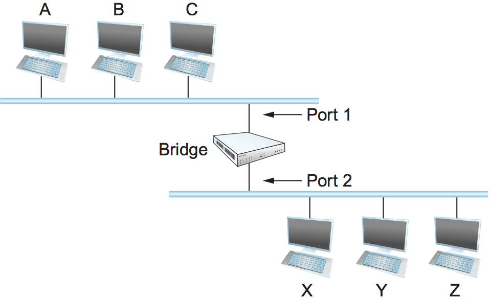
	<figcaption>Illustration of a learning bridge.</figcaption>
</figure>
	
One option would be to have a human download a table into the bridge
similar to the one given in [Table 4](#learn). Then, whenever the
bridge receives a frame on port 1 that is addressed to host A, it would
not forward the frame out on port 2; there would be no need because
host A would have already directly received the frame on the LAN
connected to port 1. Anytime a frame addressed to host A was received on
port 2, the bridge would forward the frame out on port 1.

<a id="learn"></a>

|  宿主 |  端口 |
| :-: | :-: |
|  一  |  一  |
|  乙  |  一  |
|  C  |  一  |
|  X  |  二  |
|  Y  |  二  |
|  Z  |  二  |

*表4. 由桥维护的转发表. *

实际上,没有人搭建桥,而表是手工配置的. 让一个人来维护这个表太麻烦了,而且有一个简单的技巧可以让桥接器自己学习这些信息. 想法是每座桥都要检查*来源*在它接收的所有帧中地址. 因此,当主机A向桥的两侧的主机发送帧时,桥接器接收该帧并记录在端口1上刚刚接收到来自主机A的帧. 这样,桥可以像桌子一样建造桌子. [表4](#learn).

注意,使用这种表的桥实现了前面描述的数据报 (或无连接) 转发模型的版本. 每个数据包都带有一个全局地址,桥接器通过查找表中的地址来决定发送哪个数据包. 

当一个桥第一次启动时,这个表是空的;随着时间的推移,条目被添加. 此外,超时与每个条目相关联,并且桥在指定的时间段之后丢弃条目. 这是为了防止主机 (以及因此其LAN地址) 从一个网络移动到另一个网络的情况. 因此,这个表不一定是完整的. 如果桥接器接收到一个寻址到表中当前没有的主机的帧,它将继续进行并在所有其他端口上转发该帧. 换句话说,这个表只是一个过滤掉一些帧的优化;它不需要正确性. 

### 实施

实现学习桥算法的代码非常简单,我们在这里画出来. 结构`BridgeEntry`在桥的转发表中定义单个条目;这些条目存储在`Map`结构 (支持) `mapCreate`,`mapBind`和`mapResolve`操作) 当数据包已经从表中的源到达时,能够有效地定位条目. 常数`MAX_TTL`指定一个条目在丢弃之前保留在表中的时间. 

```c
#define BRIDGE_TAB_SIZE   1024  /* max size of bridging table */
#define MAX_TTL           120   /* time (in seconds) before an entry is flushed */

typedef struct {
    MacAddr     destination;    /* MAC address of a node */
    int         ifnumber;       /* interface to reach it */
    u_short     TTL;            /* time to live */
    Binding     binding;        /* binding in the Map */
} BridgeEntry;

int     numEntries = 0;
Map     bridgeMap = mapCreate(BRIDGE_TAB_SIZE, sizeof(BridgeEntry));
```

在新的分组到达时更新转发表的例程由`updateTable`. 传递的参数是数据包中包含的源媒体访问控制 (MAC) 地址和接收它的接口号. 另一个例程 (这里未示出) 以规则的时间间隔调用,扫描转发表中的条目,并递减`TTL` (生存时间) 每个条目的字段,丢弃任何条目`TTL`已达到0. 请注意`TTL`重置为`MAX_TTL`每次数据包到达刷新现有表条目,并且能够到达目的地的接口被更新以反映最近接收的数据包. 

```c
void 
updateTable (MacAddr src, int inif) 
{
    BridgeEntry       *b;

    if (mapResolve(bridgeMap, &src, (void **)&b) == FALSE ) 
    {
        /* this address is not in the table, so try to add it */
        if (numEntries < BRIDGE_TAB_SIZE) 
        {
            b = NEW(BridgeEntry);
            b->binding = mapBind( bridgeMap, &src, b);
            /* use source address of packet as dest. address in table */
            b->destination = src;
            numEntries++;
        }
        else 
        {
            /* can`t fit this address in the table now, so give up */
            return;
        }
    }
    /* reset TTL and use most recent input interface */
    b->TTL = MAX_TTL;
    b->ifnumber = inif;
}
```

注意,在桥表已满容量的情况下,此实现采用了一个简单的策略ℴℴ它只是没有添加新地址. 回想一下,桥接表的完整性对于正确的转发是不必要的,它只是优化了性能. 如果表中有一些条目当前没有使用,它最终将超时并被删除,从而为新条目创建空间. 另一种方法是在查找表满时调用某种缓存替换算法;例如,我们可能使用最小TTL定位和删除条目以适应新条目. 

<figure class="line">
	<a id="elan3"></a>
	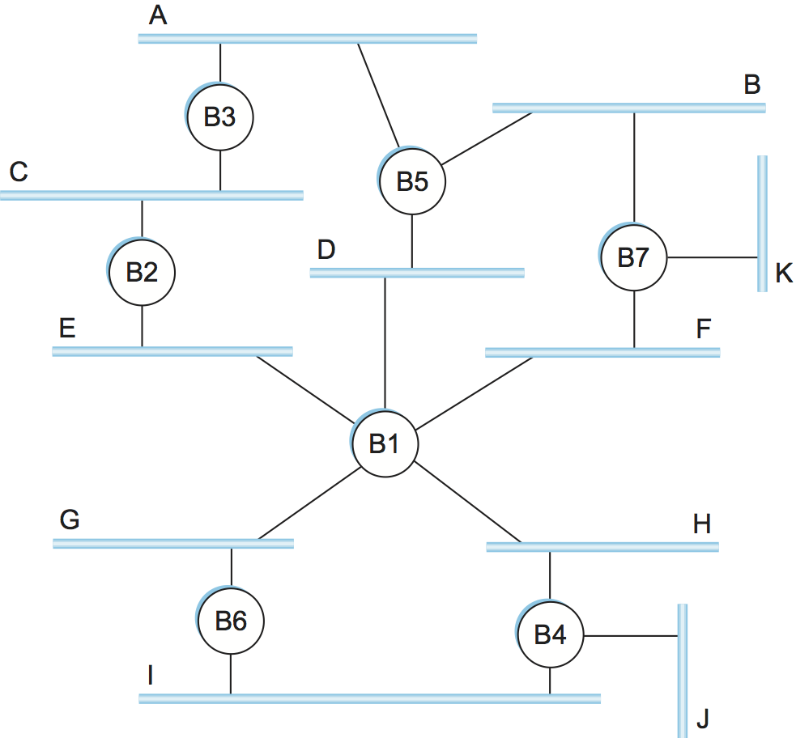
	<figcaption>Extended LAN with loops.</figcaption>
</figure>

### 生成树算法

前面的策略工作得很好,直到扩展LAN有一个循环,在这种情况下,它以可怕的方式失败-帧可能永远循环通过扩展LAN. 在所描述的示例中,这很容易看到. [图8](#elan3)例如,桥B1ㄡB4和B6形成了一个环. 假设一个分组从以太网J进入网桥B4,并且目的地址还没有在任何网桥的转发表中: B4将分组的副本发送到以太网H和I. B4在表中仍然没有这个目的地,所以它把包转发回Ethernets I和J. 没有什么可以阻止这个循环无休止地重复,在B1ㄡB4和B6之间包在两个方向上循环. 

为什么一个扩展的LAN会有一个循环呢?一种可能性是网络由多个管理员管理,例如,因为它跨越组织中的多个部门. 在这样的设置中,可能没有人知道网络的整个配置,这意味着可以添加关闭循环的桥而不需要任何人知道. 第二种,更可能的情况是,环路被内置到网络中,以在故障的情况下提供冗余. 毕竟,没有环路的网络只需要一个链路故障就可以分裂成两个独立的分区. 

不管是什么原因,桥梁必须能够正确地处理回路. 这个问题是通过让桥梁运行分布式来解决的. *生成树*算法. 如果您认为扩展的LAN是由可能具有循环 (循环) 的图来表示的,那么生成树是这个图的一个子图,它覆盖 (跨越) 了所有的顶点,但是不包含循环. 也就是说,生成树保留原始图的所有顶点,但是抛出一些边缘. 例如,[图9](#graphs)显示左边的循环图和右边可能生成的树之一. 

<figure class="line">
	<a id="graphs"></a>
	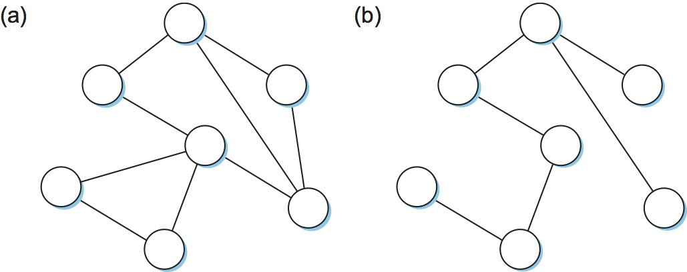
	<figcaption>Example of (a) a cyclic graph; (b) a corresponding spanning
	tree.</figcaption>
</figure>

生成树的思想非常简单: 它是实际网络拓扑的子集,没有循环,并且到达扩展LAN中的所有LAN. 最困难的部分是所有的桥梁如何协调他们的决策来到达生成树的单一视图. 毕竟,一个拓扑通常能够被多个生成树覆盖. 答案在于生成树协议,我们现在将对此进行描述. 

生成树算法是由数字设备公司的Radia Perlman开发的,是由一组桥接器使用的协议,用于为特定的扩展LAN商定生成树.  (用于局域网桥的IEEE 802.1规范基于该算法. ) 实际上,这意味着每个桥决定其所在的端口,并且不愿意转发帧. 在某种意义上,它是通过从拓扑中移除端口,将扩展的LAN还原为非循环树. 甚至有可能整个桥梁不会参与转发帧,乍一看似乎有点奇怪. 然而,该算法是动态的,这意味着,如果某些桥失效,则桥总是准备将自身重新配置成新的生成树,因此那些未使用的端口和桥提供了从故障中恢复所需的冗余容量. 

> 将扩展的LAN表示为抽象图有点尴尬. 基本上,您让网桥和局域网都对应于图的顶点,而端口则对应于图的边. 然而,我们要为这个图计算的生成树只需要跨越那些对应于网络的节点. 与桥相对应的节点可能与图的其余部分断开连接. 这对应于这样一种情况,即通过该算法移除连接到各种网络的所有端口的算法. 

生成树的主要思想是桥选择它们将转发帧的端口. 该算法选择端口如下. 每一个桥都有一个唯一的标识符,为了我们的目的,我们使用标签B1ㄡB2ㄡB3等等. 该算法首先选择具有最小ID的桥作为生成树的根;下面将详细描述如何进行这种选择. 根桥总是在所有端口上转发帧. 接下来,每个网桥计算根的最短路径,并指出它的端口在这个路径上. 这个端口也被选为桥根的首选路径. 最后,连接到给定LAN的所有桥选择单个. *指定的*将负责向根桥转发帧的桥. 每个局域网的指定桥接器是最接近根的桥接器. 如果两个或更多的桥等同地接近根,则桥的标识符用于断开连接,并且最小的ID获胜. 当然,每个网桥都连接到一个以上的LAN,因此它参与为其所连接的每个LAN选择一个指定的网桥. 实际上,这意味着每个桥决定它是否是相对于每个端口的指定桥. 桥在指定的桥的端口上转发帧. 

<figure class="line">
	<a id="elan4"></a>
	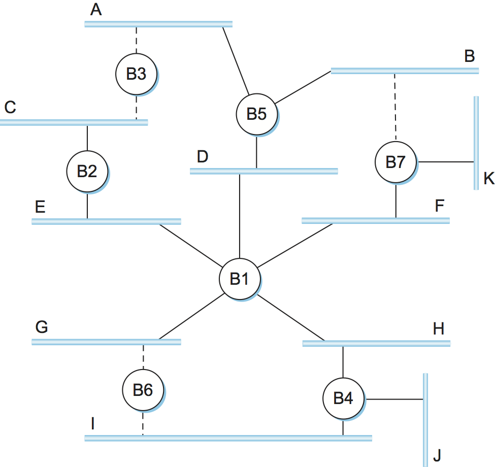
	<figcaption>Spanning tree with some ports not selected.</figcaption>
</figure>
	
[Figure 10](#elan4) shows the spanning tree that corresponds to the
extended LAN shown in [Figure 8](#elan3). In this example, B1 is the
root bridge, since it has the smallest ID. Notice that both B3 and B5
are connected to LAN A, but B5 is the designated bridge since it is
closer to the root. Similarly, both B5 and B7 are connected to LAN B,
but in this case B5 is the designated bridge since it has the smaller
ID; both are an equal distance from B1.

而人类可以查看扩展的局域网. [图8](#elan3)并计算生成树中的生成树[图10](#elan4)根据上面给出的规则,扩展LAN中的网桥没有机会看到整个网络的拓扑,更不用说窥视其他网桥的内部以查看它们的ID. R或不,它们是基于这些消息的根或指定的桥. 

具体而言,配置消息包含三条信息: 

1.  正在发送消息的桥的ID. 

2.  发送桥认为是根桥的ID. 

3.  在跳数中测量的距离,从发送桥到根桥. 

每条桥记录电流*最好的*它在每个端口上看到的配置消息 ("."在下面定义) ,包括它从其他桥接收的消息和它自己发送的消息. 

最初,每个桥都认为它是根,因此它在它的每个端口上发送一个配置消息,将自己标识为根,并且给出到根的距离0. 当通过特定端口接收到配置消息时,桥接器检查该新消息是否优于为该端口记录的当前最佳配置消息. 考虑新的配置消息*更好的*如果下列信息中的任何一项是正确的,则比当前记录的信息: 

-   它标识具有较小ID的根. 

-   它标识具有相等ID但具有较短距离的根. 

-   根ID和距离相等,但是发送桥具有较小的ID. 

如果新消息优于当前记录的信息,则桥接器丢弃旧信息并保存新信息. 但是,它首先向距离到根字段添加1,因为桥比发送消息的桥离根更远. 

当桥接器接收到指示它不是根桥接器的配置消息 (即,来自具有较小ID的桥接器的消息) 时,桥接器停止自己生成配置消息,而是仅在第一次添加1距离场. 类似地,当桥接器接收到指示它不是该端口的指定桥接器的配置消息时,即,来自桥接器的消息,该桥接器更接近根或同样远离根,但是具有较小的ID,该桥接器停止通过该端口发送配置消息. 因此,当系统稳定时,只有根网桥仍在生成配置消息,而其他网桥仅通过作为指定网桥的端口转发这些消息. 此时,已经构建了生成树,并且所有桥都一致同意使用哪些端口作为生成树. 只有那些端口可以用于在扩展LAN中转发数据分组. 

让我们来看看这个例子是如何工作的. 考虑一下会发生什么[图10](#elan4)如果电力刚刚恢复到房屋的网络,使所有的桥梁在同一时间启动. 所有的桥梁都会以自称为根部开始. 我们表示来自节点X的配置消息,其中声明它是从根节点Y起的距离d (y,d,x) . 关注节点B3上的活动,一系列事件将展开如下: 

1.  B3接收 (B2,0,B2) . 

2.  自2\<3以后,B3接受B2作为根. 

3.  B3将一个加到B2 (0) 所标示的距离上,从而向B5发送 (B2,γ1,B3) . 

4.  同时,B2接受B1作为根,因为它具有较低的ID,并且它向B3发送 (B1,1,B2) . 

5.  B5接受B1作为根,并向B3发送 (B1,1,B5) . 

6.  B3接受B1作为根,并且它注意到B2和B5都比它更接近根;因此,B3停止在它的两个接口上转发消息. 

这使得B3没有选择两个端口,如图所示[图10](#elan4).

即使在系统稳定之后,根桥接器仍继续周期性地发送配置消息,并且其他桥接器继续如前段所述,转发这些消息. 如果特定的桥失败,则下游桥接器将不接收这些配置消息,并且在等待指定时间段之后,它们将再次声明为根,并且刚刚描述的算法将再次启动以选择新的根和新的指定桥. 

需要注意的重要一点是,尽管该算法能够在桥接器故障时重新配置生成树,但是为了在拥挤的桥接器周围进行路由,它不能在替代路径上转发帧. 

### 广播组播

前面的讨论集中于如何将单播帧从一个LAN转发到另一个LAN. 由于网桥的目标是跨多个网络透明地扩展LAN,并且由于大多数LAN同时支持广播和多播,因此网桥也必须支持这两个特性. 广播很简单ℴℴ每个桥接器转发一个帧,该帧的目的地广播地址位于除了接收该帧的端口之外的每个活动 (选择) 端口上. 

多播可以以完全相同的方式实现,每个主机自己决定是否接受消息. 这正是实践中所做的. 然而,请注意,由于扩展LAN中的并非所有LAN都必须具有作为特定多播组的成员的主机,因此可以做得更好. 具体来说,生成树算法可以扩展到不需要转发多播帧的修剪网络. 考虑在局域网A上的主机发送给M组的帧[图10](#elan4). 如果在LAN J上没有属于组M的主机,那么不需要桥B4通过该网络转发帧. 另一方面,在属于组M的LAN H上没有主机并不一定意味着桥B1可以避免将组播帧转发到LAN H上,这完全取决于在LAN I和J上是否存在组M的成员. 

给定桥如何学习它是否应该在给定端口上转发多播帧?它学习与桥接器学习它是否应该在特定端口上转发单播帧的方式完全相同ℴℴ通过观察*来源*通过该端口接收的地址. 当然,组通常不是帧的来源,所以我们必须稍微作弊. 特别地,作为组M的成员的每个主机必须周期性地在帧头的源字段中发送具有组M的地址的帧. 该帧将作为其目的地地址为桥接器的多播地址. 

注意,虽然刚刚提出的组播扩展已经被提出,但是它没有被广泛采用. 相反,多播以与今天扩展LAN广播相同的方式实现. 

### 桥梁的局限性

刚刚描述的基于桥的解决方案只用于相当有限的设置ℴℴ连接少数类似的LAN. 当我们考虑尺度和异质性的问题时,桥梁的主要局限性变得明显. 

在规模问题上,通过桥梁连接多个局域网是不现实的,在实践中*很少的*其原因之一是生成树算法是线性伸缩的,也就是说,没有规定在扩展的LAN上强加层次结构. 第二个原因是桥转发所有广播帧. 虽然在一个有限设置 (例如,一个部门) 内的所有主机查看彼此的广播消息是合理的,但是在更大的环境 (例如,大公司或大学) 中的所有主机都不太可能希望被彼此的广播消息打扰. 换言之,广播不缩放,因此扩展局域网不缩放. 

提高扩展LAN的可扩展性的一种方法是*虚拟局域网* (VLAN) . VLAN允许单个扩展LAN被划分为几个看似分开的LAN. 每个虚拟局域网被分配一个标识符 (有时称为*颜色*) ,如果两个段具有相同的标识符,则数据包只能从一个段到另一段. 这具有限制在接收任何给定的广播分组的扩展LAN中的段数的效果. 

<figure class="line">
	<a id="vlan"></a>
	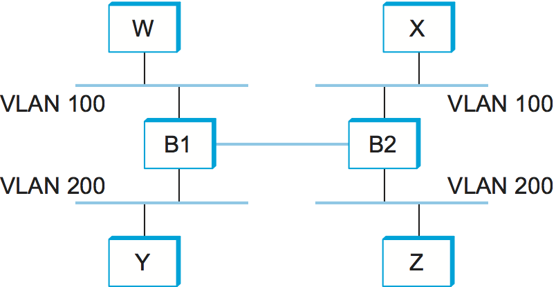
	<figcaption>Two virtual LANs share a common backbone.</figcaption>
</figure>

我们可以看到VLAN如何使用一个例子. [图11](#vlan)在四个不同的LAN段上显示四个主机. 在没有VLAN的情况下,任何主机的任何广播包都将到达所有其他主机. 现在假设我们将连接到主机W和X的段定义为一个VLAN,我们称之为VLAN 100. 我们还定义了连接到主机Y和Z的片段,它们在VLAN 200中. 要做到这一点,我们需要在桥B1和B2的每个端口上配置一个VLAN ID. B1和B2之间的链路被认为是在两个VLAN中. 

当主机X发送的数据包到达桥B2时,桥观察到它进入被配置为在VLAN 100中的端口. 它在以太网报头和它的有效负载之间插入一个VLAN报头. VLAN头的有趣部分是VLAN ID;在这种情况下,ID设置为100. 桥接器现在应用其常规规则来转发到分组,附加限制是该分组可能不会被发送到不属于VLAN 100的接口. 因此,在任何情况下,数据包ℴℴ甚至广播数据包ℴℴ都不会被发送到VLAN 200中的主机Z的接口. 然而,分组被转发到桥B1,桥B1遵循相同的规则,因此可以将分组转发到主机W,但不转发到主机Y. 

VLAN的一个有吸引力的特点是可以在不移动任何线或改变任何地址的情况下改变逻辑拓扑. 例如,如果我们希望使连接到主机Z的段成为VLAN 100的一部分,从而使XㄡW和Z能够位于相同的虚拟LAN上,那么我们只需要改变桥B2上的一个配置. 

在异质性问题上,桥梁在互连网络的种类方面是相当有限的. 特别是,网桥利用网络的帧头,因此只能支持地址格式完全相同的网络. 因此,桥接器可以用来连接以太网络到以太网,令牌环到令牌环,以及802.11个网络到另一个网络. 还可以在例如802.11网络和802.11网络之间架设桥,因为两个网络都支持相同的48位地址格式. 然而,桥不容易推广到具有不同寻址格式的其他类型的网络,例如ATM. 

尽管它们的局限性,桥梁是整个网络图片的一个非常重要的部分. 它们的主要优点是,它们允许多个LAN透明地连接;也就是说,网络可以连接而无需终端主机运行任何附加协议 (或甚至对此有所了解) . 一个潜在的例外是当主机被期望在多播组中公布它们的成员时. 

但是要注意,这种透明度可能是危险的. 如果主机或更确切地说,运行在该主机上的应用程序和传输协议是在假定它在单个LAN上运行的情况下编程的,那么在源主机和目标主机之间插入桥接器可能会产生意想不到的后果. 例如,如果网桥变得拥塞,它可能必须丢弃帧;相比之下,单个以太网很少丢弃帧. 作为另一个示例,扩展LAN上任意一对主机之间的延迟变得更大和更高可变性;相比之下,单个以太网的物理限制使得延迟既小又可预测. 作为最后一个示例,在扩展的LAN中可能 (尽管不太可能) 对帧进行重新排序;相比之下,在单个以太网上从不对帧顺序进行洗牌. 底线是,在假定网络软件将在单个以太网段上运行的前提下设计网络软件永远不安全. 桥梁发生. 
